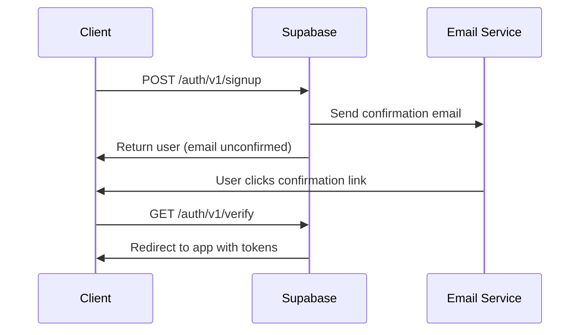
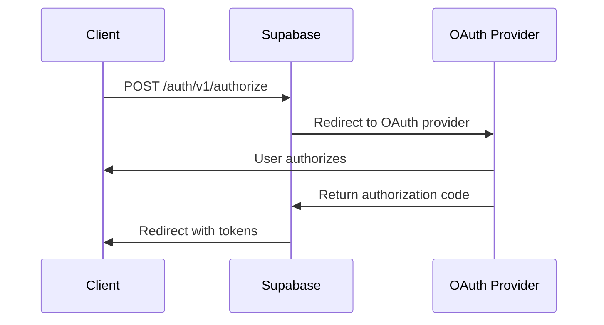

# KCT Ecosystem Authentication API Documentation

## Table of Contents
- [Authentication Overview](#authentication-overview)
- [Authentication Endpoints](#authentication-endpoints)
- [Authentication Flows](#authentication-flows)
- [JWT Token Management](#jwt-token-management)
- [User Session Management](#user-session-management)
- [Role-Based Access Control](#role-based-access-control)
- [Security Considerations](#security-considerations)
- [Error Handling](#error-handling)
- [Integration Patterns](#integration-patterns)

## Authentication Overview

The KCT ecosystem uses Supabase Authentication for secure user management, providing JWT-based authentication with multiple sign-in methods, session management, and role-based access control.

### Core Features
- Email/password authentication
- Social OAuth providers (Google, GitHub, etc.)
- Magic link authentication
- JWT token-based sessions
- Real-time session state management
- Role-based access control (RBAC)
- Multi-factor authentication support

### Architecture
- **Frontend**: Supabase client handles authentication state
- **Backend**: Supabase Edge Functions validate JWT tokens
- **Database**: User profiles and roles stored in PostgreSQL
- **Security**: Row-level security policies enforce access control

## Authentication Endpoints

### Base Configuration

```javascript
import { createClient } from '@supabase/supabase-js'

// Initialize Supabase client
export const supabase = createClient(
  process.env.NEXT_PUBLIC_SUPABASE_URL,
  process.env.NEXT_PUBLIC_SUPABASE_ANON_KEY
)
```

### Core Authentication Endpoints

#### 1. Sign Up with Email
```javascript
POST /auth/v1/signup

// Frontend implementation
async function signUp(email, password, userData = {}) {
  const { data, error } = await supabase.auth.signUp({
    email,
    password,
    options: {
      emailRedirectTo: `${window.location.protocol}//${window.location.host}/auth/callback`,
      data: userData // Additional user metadata
    }
  })

  if (error) {
    console.error('Sign up error:', error.message)
    throw error
  }

  return data
}
```

#### 2. Sign In with Email
```javascript
POST /auth/v1/token?grant_type=password

// Frontend implementation
async function signIn(email, password) {
  const { data, error } = await supabase.auth.signInWithPassword({
    email,
    password
  })

  if (error) {
    console.error('Sign in error:', error.message)
    throw error
  }

  return data
}
```

#### 3. Sign In with OAuth
```javascript
// Social authentication
async function signInWithProvider(provider) {
  const { data, error } = await supabase.auth.signInWithOAuth({
    provider, // 'google', 'github', 'discord', etc.
    options: {
      redirectTo: `${window.location.protocol}//${window.location.host}/auth/callback`
    }
  })

  if (error) {
    console.error('OAuth sign in error:', error.message)
    throw error
  }

  return data
}
```

#### 4. Magic Link Authentication
```javascript
async function signInWithMagicLink(email) {
  const { data, error } = await supabase.auth.signInWithOtp({
    email,
    options: {
      emailRedirectTo: `${window.location.protocol}//${window.location.host}/auth/callback`
    }
  })

  if (error) {
    console.error('Magic link error:', error.message)
    throw error
  }

  return data
}
```

#### 5. Get Current User
```javascript
GET /auth/v1/user

// Frontend implementation
async function getCurrentUser() {
  const { data: { user }, error } = await supabase.auth.getUser()
  
  if (error) {
    console.error('Error getting user:', error.message)
    return null
  }
  
  return user
}
```

#### 6. Sign Out
```javascript
POST /auth/v1/logout

// Frontend implementation
async function signOut() {
  const { error } = await supabase.auth.signOut()
  
  if (error) {
    console.error('Sign out error:', error.message)
    throw error
  }
}
```

#### 7. Refresh Session
```javascript
POST /auth/v1/token?grant_type=refresh_token

// Frontend implementation (handled automatically by Supabase client)
async function refreshSession() {
  const { data, error } = await supabase.auth.refreshSession()
  
  if (error) {
    console.error('Session refresh error:', error.message)
    throw error
  }
  
  return data
}
```

## Authentication Flows

### 1. Email Registration Flow



**Implementation:**
```javascript
// 1. Registration
async function registerUser(email, password, profileData) {
  try {
    const { data, error } = await supabase.auth.signUp({
      email,
      password,
      options: {
        emailRedirectTo: `${window.location.origin}/auth/callback`,
        data: {
          full_name: profileData.fullName,
          avatar_url: profileData.avatarUrl
        }
      }
    })

    if (error) throw error

    // User needs to confirm email
    return {
      success: true,
      message: 'Please check your email to confirm your account',
      user: data.user
    }
  } catch (error) {
    return {
      success: false,
      message: error.message
    }
  }
}

// 2. Handle email confirmation callback
async function handleAuthCallback() {
  const hashFragment = window.location.hash

  if (hashFragment && hashFragment.length > 0) {
    const { data, error } = await supabase.auth.exchangeCodeForSession(hashFragment)

    if (error) {
      console.error('Error confirming email:', error.message)
      window.location.href = '/login?error=' + encodeURIComponent(error.message)
      return
    }

    if (data.session) {
      // Create user profile
      await createUserProfile(data.user)
      window.location.href = '/dashboard'
      return
    }
  }

  window.location.href = '/login?error=No session found'
}
```

### 2. Social OAuth Flow



**Implementation:**
```javascript
// Social sign-in
async function signInWithGoogle() {
  const { data, error } = await supabase.auth.signInWithOAuth({
    provider: 'google',
    options: {
      redirectTo: `${window.location.origin}/auth/callback`,
      queryParams: {
        access_type: 'offline',
        prompt: 'consent'
      }
    }
  })

  if (error) {
    console.error('Google sign in error:', error.message)
    throw error
  }

  return data
}
```

### 3. Password Reset Flow

```javascript
// Request password reset
async function requestPasswordReset(email) {
  const { error } = await supabase.auth.resetPasswordForEmail(email, {
    redirectTo: `${window.location.origin}/auth/reset-password`
  })

  if (error) {
    console.error('Password reset request error:', error.message)
    throw error
  }

  return { message: 'Password reset email sent' }
}

// Update password
async function updatePassword(newPassword) {
  const { error } = await supabase.auth.updateUser({
    password: newPassword
  })

  if (error) {
    console.error('Password update error:', error.message)
    throw error
  }

  return { message: 'Password updated successfully' }
}
```

## JWT Token Management

### Token Structure
```javascript
// JWT payload structure
{
  "sub": "uuid-user-id",
  "email": "user@example.com",
  "iat": 1640000000,
  "exp": 1640003600,
  "role": "authenticated",
  "aal": "aal1",
  "amr": ["password"],
  "session_id": "uuid-session-id"
}
```

### Server-Side Token Validation

**Edge Function Example:**
```javascript
// supabase/functions/protected-endpoint/index.ts
Deno.serve(async (req) => {
  const corsHeaders = {
    'Access-Control-Allow-Origin': '*',
    'Access-Control-Allow-Headers': 'authorization, x-client-info, apikey, content-type',
    'Access-Control-Allow-Methods': 'POST, GET, OPTIONS, PUT, DELETE',
  }

  if (req.method === 'OPTIONS') {
    return new Response(null, { status: 200, headers: corsHeaders })
  }

  try {
    // Get JWT token from Authorization header
    const authHeader = req.headers.get('authorization')
    if (!authHeader) {
      throw new Error('No authorization header')
    }

    const token = authHeader.replace('Bearer ', '')
    const supabaseUrl = Deno.env.get('SUPABASE_URL')
    const serviceRoleKey = Deno.env.get('SUPABASE_SERVICE_ROLE_KEY')

    // Verify token and get user
    const userResponse = await fetch(`${supabaseUrl}/auth/v1/user`, {
      headers: {
        'Authorization': `Bearer ${token}`,
        'apikey': serviceRoleKey
      }
    })

    if (!userResponse.ok) {
      throw new Error('Invalid token')
    }

    const userData = await userResponse.json()
    
    // Process authenticated request
    return new Response(JSON.stringify({
      message: 'Authenticated request processed',
      user: userData
    }), {
      headers: { ...corsHeaders, 'Content-Type': 'application/json' }
    })

  } catch (error) {
    return new Response(JSON.stringify({
      error: error.message
    }), {
      status: 401,
      headers: { ...corsHeaders, 'Content-Type': 'application/json' }
    })
  }
})
```

### Client-Side Token Management
```javascript
// Get current session token
async function getSessionToken() {
  const { data: { session }, error } = await supabase.auth.getSession()
  
  if (error || !session) {
    console.error('No valid session')
    return null
  }
  
  return session.access_token
}

// Automatic token refresh
supabase.auth.onAuthStateChange(async (event, session) => {
  if (event === 'TOKEN_REFRESHED') {
    console.log('Token refreshed automatically')
    // Update any stored tokens
  } else if (event === 'SIGNED_OUT') {
    console.log('User signed out')
    // Clear any cached data
  }
})
```

## User Session Management

### React Auth Context Pattern

```javascript
// contexts/AuthContext.js
import React, { createContext, useContext, useEffect, useState } from 'react'

const AuthContext = createContext()

export function AuthProvider({ children }) {
  const [user, setUser] = useState(null)
  const [loading, setLoading] = useState(true)
  const [session, setSession] = useState(null)

  useEffect(() => {
    // Get initial session
    async function getInitialSession() {
      const { data: { session }, error } = await supabase.auth.getSession()
      
      if (error) {
        console.error('Error getting session:', error.message)
      } else {
        setSession(session)
        setUser(session?.user || null)
      }
      
      setLoading(false)
    }

    getInitialSession()

    // Listen for auth changes
    const { data: { subscription } } = supabase.auth.onAuthStateChange(
      (event, session) => {
        setSession(session)
        setUser(session?.user || null)
        setLoading(false)
      }
    )

    return () => subscription.unsubscribe()
  }, [])

  // Auth methods
  const signIn = async (email, password) => {
    return await supabase.auth.signInWithPassword({ email, password })
  }

  const signUp = async (email, password, userData) => {
    return await supabase.auth.signUp({
      email,
      password,
      options: { data: userData }
    })
  }

  const signOut = async () => {
    return await supabase.auth.signOut()
  }

  const resetPassword = async (email) => {
    return await supabase.auth.resetPasswordForEmail(email)
  }

  const value = {
    user,
    session,
    loading,
    signIn,
    signUp,
    signOut,
    resetPassword
  }

  return (
    <AuthContext.Provider value={value}>
      {children}
    </AuthContext.Provider>
  )
}

export function useAuth() {
  const context = useContext(AuthContext)
  if (!context) {
    throw new Error('useAuth must be used within an AuthProvider')
  }
  return context
}
```

### Protected Route Component
```javascript
// components/ProtectedRoute.js
import { useAuth } from '../contexts/AuthContext'
import { useRouter } from 'next/router'
import { useEffect } from 'react'

export default function ProtectedRoute({ children }) {
  const { user, loading } = useAuth()
  const router = useRouter()

  useEffect(() => {
    if (!loading && !user) {
      router.push('/login')
    }
  }, [user, loading, router])

  if (loading) {
    return <div>Loading...</div>
  }

  if (!user) {
    return null
  }

  return children
}
```

## Role-Based Access Control

### User Roles Table Schema
```sql
-- Create roles table
CREATE TABLE user_roles (
  id SERIAL PRIMARY KEY,
  user_id UUID REFERENCES auth.users(id) ON DELETE CASCADE,
  role VARCHAR(50) NOT NULL DEFAULT 'user',
  permissions JSONB DEFAULT '[]'::jsonb,
  created_at TIMESTAMP WITH TIME ZONE DEFAULT NOW(),
  updated_at TIMESTAMP WITH TIME ZONE DEFAULT NOW()
);

-- Create unique index
CREATE UNIQUE INDEX idx_user_roles_user_id ON user_roles(user_id);

-- Enable RLS
ALTER TABLE user_roles ENABLE ROW LEVEL SECURITY;

-- RLS Policies
CREATE POLICY "Users can view own role" ON user_roles
  FOR SELECT USING (auth.uid() = user_id);

CREATE POLICY "Admins can manage all roles" ON user_roles
  FOR ALL USING (
    EXISTS (
      SELECT 1 FROM user_roles ur 
      WHERE ur.user_id = auth.uid() 
      AND ur.role = 'admin'
    )
  );
```

### Role Management Functions
```javascript
// Get user role
async function getUserRole(userId) {
  const { data, error } = await supabase
    .from('user_roles')
    .select('role, permissions')
    .eq('user_id', userId)
    .maybeSingle()

  if (error) {
    console.error('Error fetching user role:', error.message)
    return { role: 'user', permissions: [] }
  }

  return data || { role: 'user', permissions: [] }
}

// Check user permissions
async function hasPermission(userId, permission) {
  const roleData = await getUserRole(userId)
  
  return roleData.role === 'admin' || 
         roleData.permissions.includes(permission)
}

// Role-based component
function AdminOnly({ children }) {
  const { user } = useAuth()
  const [isAdmin, setIsAdmin] = useState(false)

  useEffect(() => {
    async function checkAdminRole() {
      if (user) {
        const roleData = await getUserRole(user.id)
        setIsAdmin(roleData.role === 'admin')
      }
    }

    checkAdminRole()
  }, [user])

  if (!isAdmin) return null

  return children
}
```

## Security Considerations

### 1. Token Security
- **Storage**: Use secure, httpOnly cookies for production
- **Transmission**: Always use HTTPS in production
- **Expiry**: Implement appropriate token expiration times
- **Refresh**: Handle token refresh automatically

```javascript
// Secure token handling
const securityConfig = {
  // Client-side storage (development only)
  storage: {
    getItem: (key) => {
      if (typeof window !== 'undefined') {
        return localStorage.getItem(key)
      }
      return null
    },
    setItem: (key, value) => {
      if (typeof window !== 'undefined') {
        localStorage.setItem(key, value)
      }
    },
    removeItem: (key) => {
      if (typeof window !== 'undefined') {
        localStorage.removeItem(key)
      }
    }
  },
  // Production: Use secure cookies
  cookieOptions: {
    secure: process.env.NODE_ENV === 'production',
    httpOnly: true,
    sameSite: 'lax'
  }
}
```

### 2. Rate Limiting
```javascript
// Edge function with rate limiting
const RATE_LIMIT = 10 // requests per minute
const rateLimitMap = new Map()

function checkRateLimit(identifier) {
  const now = Date.now()
  const windowStart = now - 60000 // 1 minute window

  if (!rateLimitMap.has(identifier)) {
    rateLimitMap.set(identifier, [])
  }

  const requests = rateLimitMap.get(identifier)
  
  // Remove old requests
  const recentRequests = requests.filter(time => time > windowStart)
  
  if (recentRequests.length >= RATE_LIMIT) {
    return false
  }

  recentRequests.push(now)
  rateLimitMap.set(identifier, recentRequests)
  
  return true
}
```

### 3. Input Validation
```javascript
// Validation schemas
const authValidation = {
  email: (email) => {
    const emailRegex = /^[^\s@]+@[^\s@]+\.[^\s@]+$/
    return emailRegex.test(email)
  },
  
  password: (password) => {
    return password.length >= 8 && 
           /(?=.*[a-z])(?=.*[A-Z])(?=.*\d)/.test(password)
  },
  
  sanitizeInput: (input) => {
    return input.trim().replace(/[<>]/g, '')
  }
}

// Validate before authentication
async function validateAndSignUp(email, password, userData) {
  if (!authValidation.email(email)) {
    throw new Error('Invalid email format')
  }
  
  if (!authValidation.password(password)) {
    throw new Error('Password must be at least 8 characters with uppercase, lowercase, and number')
  }
  
  // Sanitize user data
  const sanitizedData = Object.keys(userData).reduce((acc, key) => {
    acc[key] = authValidation.sanitizeInput(userData[key])
    return acc
  }, {})
  
  return signUp(email, password, sanitizedData)
}
```

## Error Handling

### Error Types and Codes
```javascript
const AUTH_ERRORS = {
  INVALID_CREDENTIALS: 'Invalid login credentials',
  EMAIL_NOT_CONFIRMED: 'Email not confirmed',
  USER_NOT_FOUND: 'User not found',
  WEAK_PASSWORD: 'Password is too weak',
  EMAIL_ALREADY_REGISTERED: 'Email already registered',
  RATE_LIMIT_EXCEEDED: 'Too many requests',
  SESSION_EXPIRED: 'Session has expired',
  INSUFFICIENT_PERMISSIONS: 'Insufficient permissions'
}

// Error handler utility
class AuthError extends Error {
  constructor(code, message, details = {}) {
    super(message)
    this.code = code
    this.details = details
    this.name = 'AuthError'
  }
}

// Error handling wrapper
async function handleAuthOperation(operation) {
  try {
    return await operation()
  } catch (error) {
    // Map Supabase errors to application errors
    const errorCode = mapSupabaseError(error.message)
    throw new AuthError(errorCode, AUTH_ERRORS[errorCode] || error.message)
  }
}

function mapSupabaseError(message) {
  if (message.includes('Invalid login credentials')) {
    return 'INVALID_CREDENTIALS'
  } else if (message.includes('Email not confirmed')) {
    return 'EMAIL_NOT_CONFIRMED'
  } else if (message.includes('User not found')) {
    return 'USER_NOT_FOUND'
  }
  return 'UNKNOWN_ERROR'
}
```

### Frontend Error Handling
```javascript
// React error boundary for auth errors
class AuthErrorBoundary extends React.Component {
  constructor(props) {
    super(props)
    this.state = { hasError: false, error: null }
  }

  static getDerivedStateFromError(error) {
    return { hasError: true, error }
  }

  componentDidCatch(error, errorInfo) {
    console.error('Auth error:', error, errorInfo)
    // Log to error reporting service
  }

  render() {
    if (this.state.hasError) {
      return (
        <div className="error-container">
          <h2>Authentication Error</h2>
          <p>{this.state.error?.message}</p>
          <button onClick={() => this.setState({ hasError: false, error: null })}>
            Try Again
          </button>
        </div>
      )
    }

    return this.props.children
  }
}

// Toast notifications for auth errors
function useAuthErrorHandler() {
  const handleAuthError = useCallback((error) => {
    switch (error.code) {
      case 'INVALID_CREDENTIALS':
        toast.error('Invalid email or password')
        break
      case 'EMAIL_NOT_CONFIRMED':
        toast.error('Please check your email and confirm your account')
        break
      case 'WEAK_PASSWORD':
        toast.error('Password must be at least 8 characters with uppercase, lowercase, and number')
        break
      default:
        toast.error(error.message || 'An unexpected error occurred')
    }
  }, [])

  return handleAuthError
}
```

## Integration Patterns

### 1. Multi-App Authentication
```javascript
// Shared auth service for multi-app ecosystem
class KCTAuthService {
  constructor() {
    this.supabase = createClient(
      process.env.NEXT_PUBLIC_SUPABASE_URL,
      process.env.NEXT_PUBLIC_SUPABASE_ANON_KEY
    )
  }

  async signIn(email, password) {
    const { data, error } = await this.supabase.auth.signInWithPassword({
      email,
      password
    })

    if (error) throw error

    // Sync user data across apps
    await this.syncUserAcrossApps(data.user)

    return data
  }

  async syncUserAcrossApps(user) {
    // Update user profile in central database
    await this.supabase
      .from('user_profiles')
      .upsert({
        id: user.id,
        email: user.email,
        last_sign_in_at: new Date().toISOString(),
        app_permissions: await this.getUserAppPermissions(user.id)
      })
  }

  async getUserAppPermissions(userId) {
    const { data } = await this.supabase
      .from('app_permissions')
      .select('app_name, permissions')
      .eq('user_id', userId)

    return data || []
  }
}

// Usage across different apps
const authService = new KCTAuthService()
export default authService
```

### 2. API Authentication Middleware
```javascript
// Next.js API route authentication middleware
export function withAuth(handler, options = {}) {
  return async (req, res) => {
    try {
      const token = req.headers.authorization?.replace('Bearer ', '')
      
      if (!token) {
        return res.status(401).json({ error: 'No token provided' })
      }

      const { data: { user }, error } = await supabase.auth.getUser(token)
      
      if (error || !user) {
        return res.status(401).json({ error: 'Invalid token' })
      }

      // Check required roles if specified
      if (options.requiredRole) {
        const userRole = await getUserRole(user.id)
        if (userRole.role !== options.requiredRole) {
          return res.status(403).json({ error: 'Insufficient permissions' })
        }
      }

      // Add user to request object
      req.user = user
      
      return handler(req, res)
    } catch (error) {
      return res.status(500).json({ error: 'Authentication error' })
    }
  }
}

// Usage
export default withAuth(async (req, res) => {
  // Protected API route logic
  res.json({ user: req.user })
}, { requiredRole: 'admin' })
```

---

This authentication documentation provides comprehensive coverage of all authentication patterns, security considerations, and integration approaches needed for the KCT ecosystem. The examples are practical and production-ready, following Supabase best practices and modern security standards.
