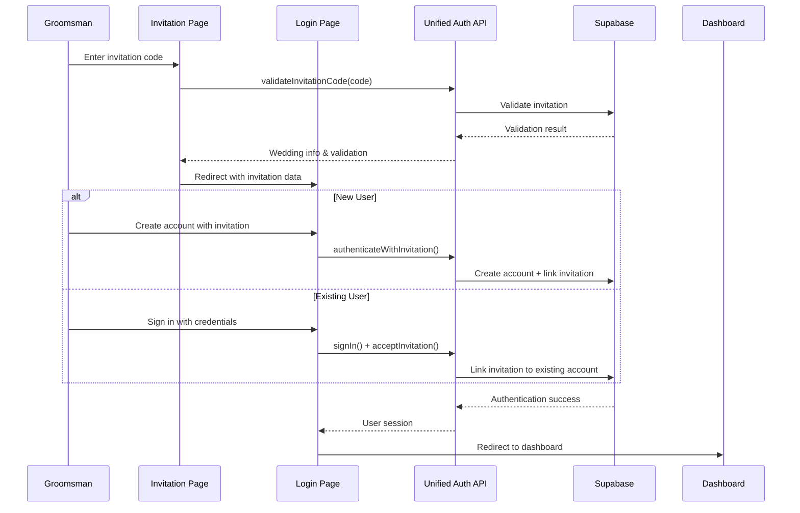

# Groomsmen Portal Technical Documentation

## Executive Summary

The Groomsmen Portal is a specialized mobile-first web application within the KCT Menswear ecosystem that provides wedding party members with a comprehensive platform for managing their wedding participation. The application features invitation-based authentication, measurement submission, outfit approval workflows, timeline synchronization, and communication tools, all integrated with the broader wedding management system through unified authentication and backend services.

## Table of Contents

1. [Application Architecture](#application-architecture)
2. [Authentication and Access System](#authentication-and-access-system)
3. [User Interface and Navigation](#user-interface-and-navigation)
4. [Core Features](#core-features)
5. [Data Management and Integration](#data-management-and-integration)
6. [Component Structure](#component-structure)
7. [API Integration](#api-integration)
8. [Security and Permissions](#security-and-permissions)
9. [Development Setup](#development-setup)
10. [Future Considerations](#future-considerations)

## Application Architecture

### Technology Stack

The Groomsmen Portal is built using modern web technologies optimized for mobile experiences:

- **Frontend Framework**: React 18.3.1 with TypeScript
- **Build Tool**: Vite 6.0.1 for fast development and optimized builds
- **Styling**: Tailwind CSS v3.4.16 for utility-first styling
- **UI Components**: Radix UI library for accessible, unstyled components
- **Form Handling**: React Hook Form v7.54.2 with Zod validation
- **Routing**: React Router DOM v6 for client-side navigation
- **State Management**: React Context API for authentication state
- **Backend Integration**: Supabase for database and edge functions
- **Charts**: Recharts v2.12.4 for data visualization

### System Architecture Overview


*Figure 1: Complete system architecture showing user flows, page components, backend integration, and external system connections.*

### Architectural Principles

1. **Mobile-First Design**: All components and layouts are optimized for mobile devices
2. **Progressive Web App (PWA) Ready**: Built to support PWA features
3. **Unified Authentication**: Seamlessly integrates with the wedding portal ecosystem
4. **Component-Based Architecture**: Modular, reusable components
5. **Type Safety**: Full TypeScript implementation for robust development

### Directory Structure

```
src/
├── components/          # Reusable UI components
├── pages/              # Route-based page components
├── lib/                # Utility functions and configurations
├── hooks/              # Custom React hooks
├── App.tsx             # Main application component
└── main.tsx            # Application entry point
```

## Authentication and Access System

### Invitation-Based Authentication Flow

The Groomsmen Portal implements a sophisticated invitation-based authentication system that ensures only authorized wedding party members can access the portal.


*Figure 2: Complete user journey from invitation receipt through wedding preparation completion.*

#### Authentication Architecture

The system uses a unified authentication API (`unified-auth.ts`) that handles multiple authentication methods:

1. **Wedding Code Authentication** (for couples)
2. **Invitation Code Authentication** (for groomsmen)
3. **Traditional Email/Password** (for existing users)

#### Invitation Workflow



#### Key Authentication Features

- **Invitation Code Validation**: Validates invitation codes before allowing account creation
- **Seamless Account Linking**: Links invitations to existing user accounts
- **Profile Data Synchronization**: Syncs profile data across all portals
- **Session Management**: Maintains authentication state across browser sessions

### Access Control and Permissions

The portal implements role-based access control:

- **Authenticated Users Only**: All main features require authentication
- **Invitation-Based Access**: Users must have a valid invitation to access the portal
- **Role-Specific Features**: Features are enabled based on wedding role and permissions

## User Interface and Navigation

### Mobile-First Design Philosophy

The Groomsmen Portal is designed with a mobile-first approach, featuring:

- **Touch-Optimized Interface**: Large touch targets and gesture-friendly interactions
- **Responsive Layout**: Adapts seamlessly to different screen sizes
- **Bottom Navigation**: Easy thumb-reach navigation for one-handed use
- **Card-Based Design**: Clean, organized content in card layouts

### Navigation Structure

The application uses a bottom navigation bar with six main sections:

1. **Dashboard** (`/dashboard`) - Main overview and quick actions
2. **Measurements** (`/measurements`) - Body measurement submission
3. **Outfit** (`/outfit`) - Outfit details and approval
4. **Timeline** (`/timeline`) - Wedding timeline and task management
5. **Messages** (`/communications`) - Communication center
6. **Profile** (`/profile`) - Personal information management

### Layout Components

#### MobileLayout Component
```typescript
interface MobileLayoutProps {
  children: React.ReactNode
  showNav?: boolean
  className?: string
}
```

The `MobileLayout` component provides:
- Consistent gradient background
- Optional bottom navigation
- Proper spacing for mobile viewports

#### BottomNav Component
- Fixed bottom navigation with 6 sections
- Active state indication with color and background changes
- Integrated sign-out button in top-right corner

## Core Features

### 1. Dashboard - Central Hub

The dashboard serves as the central hub providing:

**Key Metrics Display**:
- Days until wedding countdown
- Progress completion percentage
- Task completion status

**Quick Actions**:
- Submit measurements (if not completed)
- View outfit (when assigned)
- Check messages (with unread count badges)
- View timeline

**Progress Tracking**:
- Visual progress bar showing overall completion
- Checklist of key milestones:
  - Invitation accepted
  - Measurements submitted
  - Outfit assigned
  - Outfit approved
  - Payment completed

**Real-time Updates**:
- Recent messages preview
- Urgent task notifications
- Wedding information display

### 2. Measurement Submission and Validation

The measurement system provides comprehensive body measurement collection:

#### Measurement Categories

**Required Measurements** (in inches):
- Chest circumference
- Waist circumference  
- Hip circumference
- Shoulder width
- Sleeve length
- Inseam length
- Neck circumference

**Optional Measurements**:
- Height
- Weight

**Fit Preferences**:
- Overall fit type (slim, regular, loose)
- Jacket length (short, regular, long)  
- Trouser style (slim, straight, relaxed)

#### Validation Features

- **Field Validation**: Ensures all required measurements are provided
- **Range Validation**: Reasonable bounds checking for measurement values
- **Confidence Scoring**: System calculates confidence score based on measurement consistency
- **Professional Review**: Measurements are reviewed by KCT professionals

#### User Experience Features

- **Measurement Instructions**: Expandable instructions for accurate measurements
- **Visual Feedback**: Clear indication of completed vs. pending measurements
- **Progress Saving**: Ability to save partial measurements
- **Size Recommendations**: Automatic size recommendations upon submission

### 3. Outfit Selection and Approval Process

The outfit management system handles the complete outfit workflow:

#### Outfit Assignment Process

1. **Measurement Review**: Professional review of submitted measurements
2. **Outfit Assignment**: System assigns appropriate items based on measurements and wedding specifications
3. **Member Review**: Groomsman reviews assigned outfit
4. **Approval/Feedback**: Member approves or requests changes

#### Outfit Details Display

**Component Breakdown**:
- Individual outfit items with product IDs
- Size details for each component
- Item categories (jacket, shirt, trousers, accessories)

**Cost Transparency**:
- Detailed cost breakdown
- Rental vs. purchase item separation
- Alteration costs (if applicable)
- Total cost calculation

**Timeline Information**:
- Selection deadline
- Fitting appointment dates
- Expected delivery dates

#### Approval Workflow

- **One-Click Approval**: Simple approval for satisfied customers
- **Change Requests**: Feedback mechanism for outfit modifications
- **Status Tracking**: Real-time status updates
- **Notification System**: Alerts for status changes

### 4. Timeline Synchronization

The timeline system provides comprehensive wedding preparation tracking:

#### Timeline Features

**Progress Overview**:
- Overall completion percentage
- Task categorization (completed, pending, urgent, overdue)
- Visual progress indicators

**Task Management**:
- Task status updates (start, complete, add notes)
- Priority levels (low, medium, high, urgent)
- Due date tracking with overdue notifications
- Category-based organization

**Milestone Tracking**:
- Key wedding milestones
- Days remaining until each milestone
- Completion status for major goals

**Filtering and Views**:
- Filter by status (all, pending, completed, overdue)
- Priority-based sorting
- Category-based grouping

#### Wedding Integration

- **Real-time Sync**: Tasks sync with the main wedding portal
- **Couples Coordination**: Shared timeline visibility with couples
- **Admin Oversight**: Wedding coordinator can track progress

### 5. Communication Features and Party Coordination

The communication system facilitates seamless coordination:

#### Message Types

**Outbound Communications**:
- Messages to wedding coordinator
- Messages to the couple
- Customer support requests

**Inbound Communications**:
- Coordinator updates
- Couple messages
- System notifications
- Administrative announcements

#### Communication Features

**Message Management**:
- Read/unread status tracking
- Message threading and history
- Rich text message support
- Attachment support (planned)

**Quick Actions**:
- Pre-defined support request templates
- Emergency contact features
- Direct coordinator communication

**Notification System**:
- Unread message badges
- Push notification support (planned)
- Email integration for important updates

### 6. Profile Management

Comprehensive profile management including:

#### Personal Information
- Basic details (name, phone, email)
- Address information
- Emergency contact details

#### Wedding-Specific Data
- Dietary restrictions
- Accessibility needs
- Special requests and notes

#### Privacy and Security
- Email address protection (non-editable in portal)
- Secure data transmission
- Profile data synchronization across portals

## Data Management and Integration

### Backend Integration

The Groomsmen Portal integrates with Supabase for:

- **Authentication Management**: User sessions and authentication state
- **Database Operations**: Profile, measurement, and communication data
- **Edge Functions**: Business logic execution
- **Real-time Updates**: Live data synchronization

### Edge Functions Integration

Key edge functions:

1. **`groomsmen-dashboard`**: Dashboard data aggregation
2. **`groomsmen-measurements`**: Measurement processing and validation
3. **`groomsmen-outfit`**: Outfit management and approval
4. **`groomsmen-timeline`**: Timeline and task management
5. **`groomsmen-communications`**: Message handling

### Data Synchronization

**Profile Sync**: 
- Cross-portal profile synchronization
- Measurement data sharing with fitting systems
- Communication preferences sync

**Real-time Updates**:
- Task status changes
- Message notifications
- Outfit assignment updates
- Timeline modifications

## Component Structure

### Page Components

Located in `src/pages/`:

1. **`InvitationPage.tsx`**: Invitation code validation and entry
2. **`LoginPage.tsx`**: Authentication interface with sign-in/sign-up
3. **`DashboardPage.tsx`**: Main dashboard with overview and quick actions
4. **`MeasurementsPage.tsx`**: Measurement submission interface
5. **`OutfitPage.tsx`**: Outfit details and approval interface
6. **`TimelinePage.tsx`**: Timeline and task management
7. **`CommunicationsPage.tsx`**: Message center and communication tools
8. **`ProfilePage.tsx`**: Profile management interface

### Shared Components

Located in `src/components/`:

1. **`MobileLayout.tsx`**: Main layout wrapper for mobile optimization
2. **`BottomNav.tsx`**: Bottom navigation bar with routing
3. **`LoadingSpinner.tsx`**: Consistent loading state component
4. **`ErrorBoundary.tsx`**: Error handling and graceful fallbacks

### State Management

**Authentication Context** (`AuthContext.tsx`):
- Global authentication state
- Unified auth API integration
- Session management
- User profile access

## API Integration

### Unified Authentication API

The `unified-auth.ts` module provides:

```typescript
interface UnifiedAuthResponse {
  success: boolean
  data?: {
    user: any
    session: any
    profile: any
    wedding?: any
    invitation?: any
    access_levels?: any
    is_new_user?: boolean
  }
  error?: {
    code: string
    message: string
  }
}
```

**Key Methods**:
- `authenticateWithInvitation()`: Invitation-based authentication
- `validateInvitationCode()`: Pre-authentication validation
- `syncProfileData()`: Cross-portal data synchronization
- `getUnifiedProfile()`: Complete profile data retrieval

### Supabase Integration

**Configuration**:
- Supabase URL: `https://gvcswimqaxvylgxbklbz.supabase.co`
- Anonymous key for client-side operations
- Edge functions for server-side logic

**Edge Function Communication**:
- Standardized request/response format
- Error handling and validation
- Authentication token management

## Security and Permissions

### Authentication Security

1. **Invitation Validation**: Cryptographically secure invitation codes
2. **Session Management**: Secure session tokens with proper expiration
3. **Cross-Portal Security**: Unified authentication prevents unauthorized access
4. **Profile Data Protection**: Sensitive data encrypted in transit and at rest

### Permission Model

**Access Levels**:
- **Portal Access**: Invitation-based authorization
- **Feature Access**: Role-based feature availability
- **Data Access**: User can only access their own wedding data

**Data Protection**:
- Personal information encryption
- Secure measurement data handling
- Communication privacy protection

## Development Setup

### Prerequisites

- Node.js 18+ 
- pnpm package manager
- TypeScript knowledge
- React 18 familiarity

### Installation

```bash
cd apps/groomsmen-portal
pnpm install
```

### Development Commands

```bash
# Start development server
pnpm dev

# Build for production  
pnpm build

# Build for production environment
pnpm build:prod

# Lint code
pnpm lint

# Preview production build
pnpm preview
```

### Environment Configuration

Required environment variables in `.env`:

```env
VITE_SUPABASE_URL=https://gvcswimqaxvylgxbklbz.supabase.co
VITE_SUPABASE_ANON_KEY=<your-supabase-key>
```

### Development Features

- **Hot Module Replacement (HMR)**: Instant updates during development
- **TypeScript Compilation**: Real-time type checking
- **ESLint Integration**: Code quality enforcement
- **Tailwind CSS**: Utility-first styling with hot reload

## Future Considerations

### Planned Enhancements

1. **Progressive Web App (PWA)**:
   - Offline capability
   - Push notifications
   - App-like installation

2. **Enhanced Communication**:
   - Real-time chat features
   - Video consultation integration
   - Group messaging for wedding party

3. **Advanced Measurements**:
   - Photo-based measurement assistance
   - Virtual fitting technology
   - 3D body scanning integration

4. **Improved User Experience**:
   - Dark mode support
   - Accessibility improvements
   - Multi-language support

5. **Integration Expansions**:
   - Calendar integration
   - Social media sharing
   - Payment processing integration

### Technical Improvements

1. **Performance Optimization**:
   - Code splitting and lazy loading
   - Image optimization
   - Bundle size reduction

2. **Testing Coverage**:
   - Unit test implementation
   - Integration testing
   - E2E testing with Playwright

3. **Monitoring and Analytics**:
   - Performance monitoring
   - User behavior analytics
   - Error tracking and reporting

## Conclusion

The Groomsmen Portal represents a sophisticated, mobile-first application that seamlessly integrates with the KCT Menswear ecosystem. Its invitation-based authentication, comprehensive measurement system, outfit approval workflows, and integrated communication features provide wedding party members with a streamlined, professional experience for managing their wedding participation.

The application's architecture emphasizes security, user experience, and seamless integration with the broader wedding management system, positioning it as a key component in the digital transformation of wedding party coordination and menswear services.
