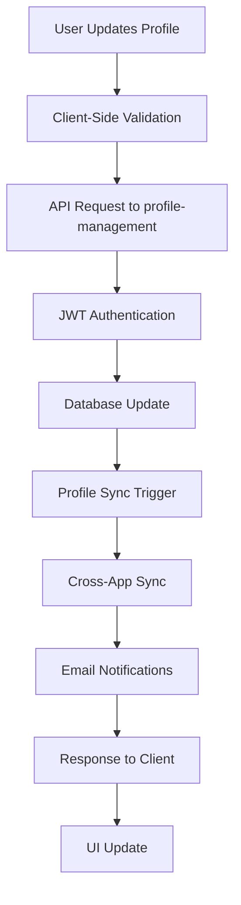
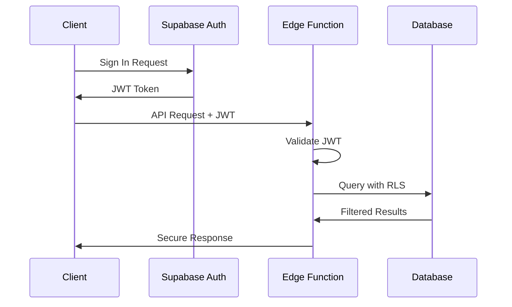

# User Profiles Application - Technical Documentation

## Executive Summary

The User Profiles application is a comprehensive customer profile management system within the KCT ecosystem, designed to handle sensitive customer data, measurement tracking, style personalization, and cross-application synchronization. Built using React 18, TypeScript, and Supabase, it provides a robust foundation for customer relationship management with advanced privacy controls and real-time synchronization capabilities.

**Key Capabilities:**
- Multi-dimensional customer profile management with completion tracking
- Advanced measurement tracking system for menswear sizing
- AI-driven style preference profiling and recommendations
- Real-time cross-application profile synchronization
- Enterprise-grade security with Row-Level Security (RLS)
- Automated email communication workflows
- Mobile-responsive progressive web application

## 1. Customer Profile Management Architecture

### 1.1 Core Profile Data Model

The user profiles system is built around a comprehensive data model that extends Supabase's authentication with rich customer information:

```typescript
interface UserProfile {
  // Identity & Authentication
  id: string
  user_id: string (Supabase Auth UUID)
  email: string
  
  // Personal Information
  first_name?: string
  last_name?: string
  display_name?: string
  phone?: string
  date_of_birth?: string
  gender?: string
  
  // Address Information  
  address_line_1?: string
  address_line_2?: string
  city?: string
  state?: string
  postal_code?: string
  country?: string
  
  // Customer Analytics
  total_orders: number
  total_spent: number
  average_order_value: number
  lifetime_value: number
  engagement_score: number
  customer_tier: string ('Bronze' | 'Silver' | 'Gold' | 'Platinum')
  customer_segment: string
  repeat_customer: boolean
  vip_status: boolean
  
  // Wedding Integration
  is_wedding_customer: boolean
  wedding_role?: string
  wedding_preferences?: any
  
  // Profile Management
  onboarding_completed: boolean
  email_verified: boolean
  account_status: string
  last_order_date?: string
  acquisition_source?: string
  
  // Complex Objects
  size_profile: SizeProfile
  notification_preferences: NotificationPreferences
  saved_addresses: any[]
  saved_payment_methods: any[]
  wishlist_items: any[]
  style_preferences: any
  measurements: any
  measurement_history?: any
  
  // Audit Fields
  created_at: string
  updated_at: string
}
```

### 1.2 Profile Completion System

The application implements a sophisticated profile completion tracking system that guides users through the onboarding process:

**Completion Calculation Algorithm:**
```typescript
const getCompletionScore = () => {
  const fields = [
    profile.first_name,
    profile.last_name,
    profile.phone,
    profile.date_of_birth,
    profile.address_line_1,
    profile.city,
    profile.state,
    profile.size_profile?.chest,
    profile.size_profile?.waist,
    profile.size_profile?.inseam
  ]
  
  const completedFields = fields.filter(field => 
    field && field.toString().length > 0
  )
  return Math.round((completedFields.length / fields.length) * 100)
}
```

**Visual Progress Tracking:**
- Real-time completion percentage display
- Progressive UI disclosure based on completion status
- Automated email reminders for incomplete profiles (50-99% completion)
- Gamification elements with customer tier progression

### 1.3 Multi-Tier Customer Segmentation

The system implements dynamic customer tiering based on engagement and purchase history:

- **Bronze (Default):** New customers, basic profile completion
- **Silver:** Completed profile, 1+ orders, engagement score 25+
- **Gold:** Multiple orders, $500+ lifetime value, engagement score 50+
- **Platinum:** VIP status, $1000+ lifetime value, engagement score 75+

Customer tiers unlock features like:
- Priority customer support
- Early access to new products
- Personalized styling consultations
- Exclusive event invitations

## 2. Measurement Tracking and Validation Systems

### 2.1 Menswear Measurement Schema

The application features a comprehensive menswear measurement system designed for precision tailoring:

```typescript
interface MenswearMeasurement {
  // Standard Suit Measurements
  suit_size?: string        // e.g., "40R", "42L"
  chest?: number           // inches/cm
  waist?: number          // inches/cm  
  inseam?: number         // inches/cm
  sleeve?: number         // inches/cm
  neck?: number           // inches/cm
  shoulder_width?: number  // inches/cm
  jacket_length?: number   // inches/cm
  trouser_rise?: number    // inches/cm
  
  // Physical Measurements
  height?: number         // inches/cm
  weight?: number         // pounds/kg
  shoe_size?: number      // US sizing
  
  // Additional Detail Measurements
  hips?: number
  thigh?: number
  bicep?: number
  forearm?: number
  wrist?: number
  
  // Fit Preferences
  preferred_fit: 'slim' | 'regular' | 'relaxed'
  measurement_unit: 'imperial' | 'metric'
  
  // Quality Assurance
  measured_by: 'self' | 'professional'
  measurement_accuracy: 'estimated' | 'professional' | 'tailored'
  last_measured?: string
  notes?: string
  
  // System Management
  is_active: boolean
  user_profile_id: UUID
  created_at: string
  updated_at: string
}
```

### 2.2 Measurement Validation & Recommendations

**Automatic Suit Size Calculation:**
```typescript
const getSuitSizeRecommendation = () => {
  if (!measurements.chest) return null
  
  const chest = measurements.chest
  let size = ''
  
  // Size Chart Logic
  if (chest <= 36) size = '36'
  else if (chest <= 38) size = '38'
  else if (chest <= 40) size = '40'
  else if (chest <= 42) size = '42'
  else if (chest <= 44) size = '44'
  else if (chest <= 46) size = '46'
  else size = '48+'
  
  // Length Modifiers
  const height = measurements.height
  if (height && height < 68) size += 'S'      // Short
  else if (height && height > 74) size += 'L' // Long
  else size += 'R'                             // Regular
  
  return size
}
```

**Quality Assurance Features:**
- Real-time validation of measurement ranges
- Consistency checks across related measurements
- Historical measurement comparison
- Professional vs. self-measurement tracking
- Automated fit recommendations based on body type

### 2.3 Measurement History & Versioning

The system maintains complete measurement history with versioning:

- **Active Measurement:** Current measurements used for recommendations
- **Historical Records:** All previous measurements with timestamps
- **Change Tracking:** Automatic deactivation of old measurements when new ones are added
- **Professional Override:** Professional measurements take precedence over self-measurements
- **Measurement Reminders:** Automated reminders to update measurements annually

## 3. Preference Management and Personalization

### 3.1 Style Profile System

The application implements a comprehensive style profiling system that captures customer preferences across multiple dimensions:

```typescript
interface StyleProfile {
  // Core Style Identity
  style_personality?: 'classic' | 'modern' | 'creative' | 'business' | 'casual' | 'trendy'
  body_type?: 'athletic' | 'slim' | 'average' | 'heavy'
  
  // Preference Arrays
  color_preferences: string[]          // navy, charcoal, black, burgundy, etc.
  brand_preferences: string[]          // luxury, contemporary, budget brands
  fabric_preferences: string[]         // cotton, wool, linen, silk, cashmere
  pattern_preferences: string[]        // solid, pinstripes, checks, plaids
  style_goals: string[]               // professional, casual, formal, trendy
  
  // Complex Preference Objects
  lifestyle_preferences: {
    work_environment?: string
    social_activities?: string[]
    travel_frequency?: string
    climate_considerations?: string
  }
  
  occasion_preferences: {
    'Work/Business': boolean
    'Social Events': boolean
    'Casual Outings': boolean
    'Special Occasions': boolean
    'Travel': boolean
    'Wedding Events': boolean
    'Date Nights': boolean
    'Weekend Wear': boolean
  }
  
  budget_preferences: {
    range: 'budget' | 'moderate' | 'premium' | 'luxury'
    typical_budget_min?: number
    typical_budget_max?: number
  }
  
  // AI-Driven Insights
  ai_insights: any
  fit_preferences: any
  seasonal_preferences: any
  recommendation_history: any[]
  
  // System Fields
  user_profile_id: UUID
  last_style_update: string
  created_at: string
  updated_at: string
}
```

### 3.2 AI-Powered Recommendation Engine

The style profiling system feeds into an AI-powered recommendation engine that provides:

**Personalized Recommendations:**
- Suit recommendations based on body type, style personality, and occasion preferences
- Color palette suggestions aligned with customer preferences
- Fit recommendations optimized for body measurements
- Seasonal wardrobe planning based on lifestyle patterns

**Recommendation Categories:**
```typescript
interface StyleRecommendations {
  suits: {
    title: string
    description: string
    size?: string
    confidence_score: number
    reasoning: string[]
  }[]
  
  fit_advice: string[]
  color_suggestions: string[]
  fabric_recommendations: string[]
  occasion_styling: {
    occasion: string
    recommendations: string[]
  }[]
}
```

### 3.3 Preference Learning & Adaptation

The system implements machine learning capabilities to improve recommendations over time:

- **Interaction Tracking:** User clicks, views, and purchases inform the recommendation algorithm
- **Feedback Loops:** Direct user feedback on recommendations improves future suggestions
- **Seasonal Adaptation:** Preferences adapt based on seasonal purchasing patterns
- **Trend Integration:** Current fashion trends are balanced with personal preferences
- **Cross-Customer Learning:** Anonymous preference patterns improve recommendations across users

## 4. Order History and Analytics Integration

### 4.1 Customer Analytics Pipeline

The user profiles application integrates deeply with order management and analytics systems:

**Order Integration Schema:**
```typescript
interface CustomerAnalytics {
  // Order Metrics
  total_orders: number
  total_spent: number
  average_order_value: number
  lifetime_value: number
  
  // Engagement Tracking
  engagement_score: number          // 0-100 calculated score
  last_order_date?: string
  first_purchase_date?: string
  last_purchase_date?: string
  days_since_last_purchase?: number
  
  // Behavior Analysis
  preferred_categories?: string[]    // Based on purchase history
  repeat_customer: boolean          // Multiple orders
  seasonal_purchase_patterns?: any
  price_sensitivity_score?: number
  
  // Customer Lifecycle
  acquisition_source?: string       // Marketing attribution
  customer_segment: string          // Behavioral segmentation
  churn_risk_score?: number        // Predictive analytics
}
```

### 4.2 Real-Time Analytics Integration

**Data Flow Architecture:**
1. **Order Events:** New orders trigger profile updates via webhooks
2. **Analytics Processing:** Order data feeds into customer analytics calculations
3. **Profile Updates:** Analytics results update customer tier and engagement scores
4. **Recommendation Refresh:** New order data triggers recommendation recalculation

**Engagement Score Calculation:**
The engagement score is a composite metric including:
- Order frequency (weight: 30%)
- Profile completion (weight: 20%)
- Style profile activity (weight: 20%)
- Email interaction rates (weight: 15%)
- Website activity (weight: 15%)

### 4.3 Predictive Analytics Features

- **Churn Prediction:** ML models identify customers at risk of churning
- **Lifetime Value Prediction:** Predictive models forecast customer CLV
- **Next Purchase Prediction:** Timing and category predictions for next orders
- **Price Optimization:** Personalized pricing based on sensitivity analysis

## 5. Profile Synchronization Across Applications

### 5.1 Unified Authentication & Profile Sync

The KCT ecosystem implements a unified authentication system with cross-application profile synchronization:

**Sync Architecture:**
```typescript
// Profile Sync Function Structure
interface ProfileSyncActions {
  sync_profile_data: (user_id: string, profile_data: Partial<UserProfile>) => Promise<SyncResult>
  sync_measurement_data: (user_id: string, measurements: MenswearMeasurement) => Promise<SyncResult>
  get_unified_profile: (user_id: string) => Promise<UnifiedProfile>
}

interface UnifiedProfile {
  profile: UserProfile
  access_levels: {
    enhanced_profile: boolean
    couples_portal: boolean
    groomsmen_portal: boolean
    admin_portal: boolean
  }
  wedding_party_data?: WeddingPartyData
  couple_wedding_data?: WeddingData
  portal_context: {
    current_portal: string
    available_portals: string[]
    primary_role: string
  }
}
```

### 5.2 Cross-Application Data Synchronization

**Synchronization Targets:**
1. **Wedding Portal:** Bride/groom profile data and preferences
2. **Groomsmen Portal:** Wedding party member information and measurements
3. **Admin Hub:** Customer service and order management data
4. **Inventory Manager:** Size and preference data for stock planning
5. **Order Management:** Customer history and preferences

**Sync Operations:**
- **Profile Data Sync:** Basic information (name, contact, address)
- **Measurement Sync:** Size data across all measurement systems
- **Preference Sync:** Style and fit preferences for recommendations
- **Order History Sync:** Purchase data and analytics
- **Communication Preferences:** Notification settings across all platforms

### 5.3 Conflict Resolution & Data Integrity

**Data Precedence Rules:**
1. **Most Recent Update:** Timestamp-based precedence for conflicting data
2. **Source Authority:** Professional measurements override self-measurements
3. **User Intent:** Manual updates take precedence over automated sync
4. **Data Completeness:** More complete records take precedence over partial data

**Integrity Safeguards:**
- Atomic transaction processing for multi-table updates
- Rollback mechanisms for failed sync operations
- Data validation across all synchronized fields
- Audit logging for all sync operations

## 6. Privacy and Security Considerations

### 6.1 Authentication & Authorization Architecture

**Multi-Layer Security Model:**
```typescript
// Row Level Security (RLS) Implementation
CREATE POLICY "Users can only access their own profile" ON user_profiles
  FOR ALL USING (auth.uid()::text = user_id::text);

CREATE POLICY "Users can only access their own measurements" ON menswear_measurements
  FOR ALL USING (EXISTS (
    SELECT 1 FROM user_profiles 
    WHERE user_profiles.id = menswear_measurements.user_profile_id 
    AND user_profiles.user_id::text = auth.uid()::text
  ));
```

**Authentication Flow:**
1. **Supabase Auth:** JWT-based authentication with automatic token refresh
2. **Session Management:** Secure session handling with auto-logout on inactivity
3. **Multi-Factor Authentication:** Optional 2FA for enhanced security
4. **Social Login Integration:** Google, Facebook, Apple Sign-In support

### 6.2 Data Privacy Implementation

**Privacy Controls:**
- **Data Minimization:** Only collect necessary data for functionality
- **Consent Management:** Explicit consent for data collection and processing
- **Right to Deletion:** Complete profile deletion with data anonymization
- **Data Portability:** Export functionality for user data
- **Access Logging:** Comprehensive audit trails for data access

**GDPR/CCPA Compliance Features:**
```typescript
interface PrivacyControls {
  data_collection_consent: {
    basic_profile: boolean
    measurements: boolean
    style_preferences: boolean
    marketing_communications: boolean
    analytics_tracking: boolean
    consent_date: string
  }
  
  data_retention: {
    profile_data: string      // e.g., "7 years"
    measurement_history: string
    order_history: string
    marketing_data: string
  }
  
  privacy_settings: {
    data_sharing_enabled: boolean
    analytics_opt_in: boolean
    marketing_opt_in: boolean
    research_participation: boolean
  }
}
```

### 6.3 Data Security Measures

**Encryption Standards:**
- **Data at Rest:** AES-256 encryption for all sensitive data
- **Data in Transit:** TLS 1.3 for all API communications
- **Field-Level Encryption:** Additional encryption for PII fields
- **Key Management:** Automated key rotation and secure key storage

**Security Monitoring:**
- **Intrusion Detection:** Real-time monitoring for suspicious activity
- **Rate Limiting:** API rate limiting to prevent abuse
- **SQL Injection Prevention:** Parameterized queries and input validation
- **XSS Protection:** Content Security Policy and input sanitization

## 7. Component Structure and State Management

### 7.1 React Application Architecture

**Component Hierarchy:**
```
App.tsx (Root)
├── AuthProvider (Context)
├── LoginForm (Unauthenticated State)
└── ProfileDashboard (Authenticated State)
    ├── ProfileTabs (Navigation)
    ├── OverviewTab
    │   ├── PersonalInformation
    │   ├── AddressInformation
    │   └── AccountSummary
    ├── MeasurementsInterface
    │   ├── SuitMeasurements
    │   ├── ShirtMeasurements
    │   └── PhysicalStats
    ├── StyleProfileInterface
    │   ├── PersonalitySelection
    │   ├── ColorPreferences
    │   ├── FabricPreferences
    │   └── LifestylePreferences
    └── PreferencesTab
        ├── NotificationSettings
        └── PrivacyControls
```

### 7.2 State Management Strategy

**Context-Based State Management:**
```typescript
// Authentication Context
interface AuthContextType {
  user: User | null
  loading: boolean
  signIn: (email: string, password: string) => Promise<any>
  signUp: (email: string, password: string) => Promise<any>
  signOut: () => Promise<any>
}

// Profile State Management
interface ProfileState {
  profile: UserProfile | null
  measurements: MenswearMeasurement | null
  styleProfile: StyleProfile | null
  loading: {
    profile: boolean
    measurements: boolean
    style: boolean
  }
  errors: {
    profile?: string
    measurements?: string
    style?: string
  }
}
```

**Local State Management:**
- **Form State:** React Hook Form for complex form validation
- **UI State:** Local useState for component-specific state
- **Cache State:** SWR/React Query for server state management
- **Optimistic Updates:** UI updates before server confirmation

### 7.3 Component Design Patterns

**Container/Presentational Pattern:**
- **Container Components:** Handle data fetching and business logic
- **Presentational Components:** Pure components focused on UI rendering
- **Custom Hooks:** Reusable logic for common operations

**Error Boundary Implementation:**
```typescript
class ProfileErrorBoundary extends React.Component {
  constructor(props: any) {
    super(props);
    this.state = { hasError: false, error: null };
  }

  static getDerivedStateFromError(error: Error) {
    return { hasError: true, error };
  }

  componentDidCatch(error: Error, errorInfo: ErrorInfo) {
    console.error('Profile Error:', error, errorInfo);
    // Log to error reporting service
  }

  render() {
    if (this.state.hasError) {
      return <ProfileErrorFallback error={this.state.error} />;
    }

    return this.props.children;
  }
}
```

## 8. Database Schema for User Profiles and Measurements

### 8.1 Core Tables Structure

**user_profiles Table:**
```sql
CREATE TABLE user_profiles (
  id UUID PRIMARY KEY DEFAULT gen_random_uuid(),
  user_id UUID NOT NULL UNIQUE REFERENCES auth.users(id) ON DELETE CASCADE,
  
  -- Personal Information
  email TEXT NOT NULL,
  display_name TEXT,
  first_name TEXT,
  last_name TEXT,
  phone TEXT,
  date_of_birth DATE,
  gender TEXT,
  
  -- Address Information
  address_line_1 TEXT,
  address_line_2 TEXT,
  city TEXT,
  state TEXT,
  postal_code TEXT,
  country TEXT DEFAULT 'US',
  
  -- Customer Analytics
  total_orders INTEGER DEFAULT 0,
  total_spent DECIMAL(12,2) DEFAULT 0,
  average_order_value DECIMAL(10,2) DEFAULT 0,
  lifetime_value DECIMAL(12,2) DEFAULT 0,
  engagement_score INTEGER DEFAULT 0,
  customer_tier TEXT DEFAULT 'Bronze',
  customer_segment TEXT DEFAULT 'regular',
  repeat_customer BOOLEAN DEFAULT FALSE,
  vip_status BOOLEAN DEFAULT FALSE,
  
  -- Complex JSON Fields
  size_profile JSONB DEFAULT '{}',
  notification_preferences JSONB DEFAULT '{}',
  saved_addresses JSONB DEFAULT '[]',
  saved_payment_methods JSONB DEFAULT '[]',
  wishlist_items JSONB DEFAULT '[]',
  style_preferences JSONB DEFAULT '{}',
  measurements JSONB DEFAULT '{}',
  measurement_history JSONB DEFAULT '{}',
  wedding_preferences JSONB DEFAULT '{}',
  
  -- System Fields
  is_wedding_customer BOOLEAN DEFAULT FALSE,
  wedding_role TEXT,
  onboarding_completed BOOLEAN DEFAULT FALSE,
  email_verified BOOLEAN DEFAULT FALSE,
  account_status TEXT DEFAULT 'active',
  acquisition_source TEXT,
  last_order_date TIMESTAMPTZ,
  first_purchase_date TIMESTAMPTZ,
  last_purchase_date TIMESTAMPTZ,
  days_since_last_purchase INTEGER,
  
  -- Audit Fields
  created_at TIMESTAMPTZ DEFAULT NOW(),
  updated_at TIMESTAMPTZ DEFAULT NOW(),
  
  -- Constraints
  CONSTRAINT valid_customer_tier CHECK (customer_tier IN ('Bronze', 'Silver', 'Gold', 'Platinum')),
  CONSTRAINT valid_account_status CHECK (account_status IN ('active', 'inactive', 'suspended')),
  CONSTRAINT valid_engagement_score CHECK (engagement_score >= 0 AND engagement_score <= 100)
);
```

**menswear_measurements Table:**
```sql
CREATE TABLE menswear_measurements (
  id UUID PRIMARY KEY DEFAULT gen_random_uuid(),
  user_profile_id UUID NOT NULL REFERENCES user_profiles(id) ON DELETE CASCADE,
  
  -- Standard Suit Measurements (inches/cm)
  suit_size VARCHAR(10),
  chest DECIMAL(5,2),
  waist DECIMAL(5,2),
  inseam DECIMAL(5,2),
  sleeve DECIMAL(5,2),
  neck DECIMAL(5,2),
  shoulder_width DECIMAL(5,2),
  jacket_length DECIMAL(5,2),
  trouser_rise DECIMAL(5,2),
  
  -- Physical Measurements
  height INTEGER,
  weight INTEGER,
  shoe_size DECIMAL(4,1),
  
  -- Additional Measurements
  hips DECIMAL(5,2),
  thigh DECIMAL(5,2),
  bicep DECIMAL(5,2),
  forearm DECIMAL(5,2),
  wrist DECIMAL(5,2),
  
  -- Preferences
  preferred_fit TEXT DEFAULT 'regular' CHECK (preferred_fit IN ('slim', 'regular', 'relaxed')),
  measurement_unit TEXT DEFAULT 'imperial' CHECK (measurement_unit IN ('imperial', 'metric')),
  notes TEXT,
  
  -- Quality Tracking
  last_measured DATE,
  measured_by TEXT DEFAULT 'self' CHECK (measured_by IN ('self', 'professional')),
  measurement_accuracy TEXT DEFAULT 'estimated' CHECK (measurement_accuracy IN ('estimated', 'professional', 'tailored')),
  
  -- System Fields
  is_active BOOLEAN DEFAULT TRUE,
  created_at TIMESTAMPTZ DEFAULT NOW(),
  updated_at TIMESTAMPTZ DEFAULT NOW()
);
```

**style_profiles Table:**
```sql
CREATE TABLE style_profiles (
  id UUID PRIMARY KEY DEFAULT gen_random_uuid(),
  user_profile_id UUID NOT NULL REFERENCES user_profiles(id) ON DELETE CASCADE,
  customer_id UUID, -- Legacy field for migration
  
  -- Style Identity
  body_type TEXT,
  style_personality TEXT,
  
  -- Preference Arrays (stored as JSONB)
  color_preferences JSONB DEFAULT '[]',
  brand_preferences JSONB DEFAULT '[]',
  fabric_preferences JSONB DEFAULT '[]',
  pattern_preferences JSONB DEFAULT '[]',
  style_goals JSONB DEFAULT '[]',
  inspiration_sources JSONB DEFAULT '[]',
  
  -- Complex Preference Objects
  fit_preferences JSONB DEFAULT '{}',
  size_preferences JSONB DEFAULT '{}',
  lifestyle_preferences JSONB DEFAULT '{}',
  occasion_preferences JSONB DEFAULT '{}',
  budget_preferences JSONB DEFAULT '{}',
  seasonal_preferences JSONB DEFAULT '{}',
  
  -- AI & Analytics
  ai_insights JSONB DEFAULT '{}',
  recommendation_history JSONB DEFAULT '[]',
  
  -- System Fields
  last_style_update TIMESTAMPTZ DEFAULT NOW(),
  created_at TIMESTAMPTZ DEFAULT NOW(),
  updated_at TIMESTAMPTZ DEFAULT NOW(),
  
  -- Constraints
  CONSTRAINT unique_user_style_profile UNIQUE (user_profile_id),
  CONSTRAINT valid_style_personality CHECK (style_personality IN ('classic', 'modern', 'creative', 'business', 'casual', 'trendy')),
  CONSTRAINT valid_body_type CHECK (body_type IN ('athletic', 'slim', 'average', 'heavy'))
);
```

### 8.2 Indexes and Performance Optimization

**Strategic Indexing:**
```sql
-- Authentication and lookup indexes
CREATE INDEX idx_user_profiles_user_id ON user_profiles(user_id);
CREATE INDEX idx_user_profiles_email ON user_profiles(email);

-- Customer analytics indexes
CREATE INDEX idx_user_profiles_customer_tier ON user_profiles(customer_tier);
CREATE INDEX idx_user_profiles_engagement_score ON user_profiles(engagement_score DESC);
CREATE INDEX idx_user_profiles_total_spent ON user_profiles(total_spent DESC);
CREATE INDEX idx_user_profiles_last_order_date ON user_profiles(last_order_date DESC);

-- Measurement lookup indexes
CREATE INDEX idx_menswear_measurements_user_profile_id ON menswear_measurements(user_profile_id);
CREATE INDEX idx_menswear_measurements_active ON menswear_measurements(user_profile_id, is_active) WHERE is_active = TRUE;

-- Style profile indexes
CREATE INDEX idx_style_profiles_user_profile_id ON style_profiles(user_profile_id);
CREATE INDEX idx_style_profiles_personality ON style_profiles(style_personality);
CREATE INDEX idx_style_profiles_body_type ON style_profiles(body_type);

-- JSONB indexes for complex queries
CREATE INDEX idx_user_profiles_notification_prefs ON user_profiles USING GIN (notification_preferences);
CREATE INDEX idx_style_profiles_color_prefs ON style_profiles USING GIN (color_preferences);
CREATE INDEX idx_style_profiles_occasion_prefs ON style_profiles USING GIN (occasion_preferences);
```

### 8.3 Database Views and Functions

**Comprehensive Profile View:**
```sql
CREATE OR REPLACE VIEW unified_customer_profiles AS
SELECT 
  up.id,
  up.user_id,
  up.email,
  up.first_name,
  up.last_name,
  up.customer_tier,
  up.total_spent,
  up.engagement_score,
  mm.suit_size,
  mm.chest,
  mm.waist,
  mm.preferred_fit,
  sp.style_personality,
  sp.body_type,
  sp.color_preferences,
  up.created_at,
  up.updated_at
FROM user_profiles up
LEFT JOIN menswear_measurements mm ON up.id = mm.user_profile_id AND mm.is_active = TRUE
LEFT JOIN style_profiles sp ON up.id = sp.user_profile_id;
```

**Profile Completion Function:**
```sql
CREATE OR REPLACE FUNCTION calculate_profile_completion(profile_id UUID)
RETURNS INTEGER AS $$
DECLARE
  completion_score INTEGER;
  profile_record RECORD;
  measurement_record RECORD;
  style_record RECORD;
BEGIN
  -- Get profile data
  SELECT * INTO profile_record FROM user_profiles WHERE id = profile_id;
  SELECT * INTO measurement_record FROM menswear_measurements 
    WHERE user_profile_id = profile_id AND is_active = TRUE;
  SELECT * INTO style_record FROM style_profiles WHERE user_profile_id = profile_id;
  
  completion_score := 0;
  
  -- Basic profile fields (40% weight)
  IF profile_record.first_name IS NOT NULL AND LENGTH(TRIM(profile_record.first_name)) > 0 THEN
    completion_score := completion_score + 8;
  END IF;
  IF profile_record.last_name IS NOT NULL AND LENGTH(TRIM(profile_record.last_name)) > 0 THEN
    completion_score := completion_score + 8;
  END IF;
  IF profile_record.phone IS NOT NULL AND LENGTH(TRIM(profile_record.phone)) > 0 THEN
    completion_score := completion_score + 8;
  END IF;
  IF profile_record.address_line_1 IS NOT NULL AND LENGTH(TRIM(profile_record.address_line_1)) > 0 THEN
    completion_score := completion_score + 8;
  END IF;
  IF profile_record.city IS NOT NULL AND LENGTH(TRIM(profile_record.city)) > 0 THEN
    completion_score := completion_score + 8;
  END IF;
  
  -- Measurement fields (40% weight)
  IF measurement_record.chest IS NOT NULL THEN
    completion_score := completion_score + 10;
  END IF;
  IF measurement_record.waist IS NOT NULL THEN
    completion_score := completion_score + 10;
  END IF;
  IF measurement_record.inseam IS NOT NULL THEN
    completion_score := completion_score + 10;
  END IF;
  IF measurement_record.height IS NOT NULL THEN
    completion_score := completion_score + 10;
  END IF;
  
  -- Style profile fields (20% weight)
  IF style_record.style_personality IS NOT NULL THEN
    completion_score := completion_score + 10;
  END IF;
  IF style_record.body_type IS NOT NULL THEN
    completion_score := completion_score + 10;
  END IF;
  
  RETURN completion_score;
END;
$$ LANGUAGE plpgsql;
```

## 9. API Endpoints and Data Flows

### 9.1 Supabase Edge Function Architecture

The user profiles system leverages Supabase Edge Functions for secure, server-side operations:

**Core API Endpoints:**

1. **Profile Management Function** (`/functions/v1/profile-management`)
```typescript
interface ProfileManagementAPI {
  // GET /functions/v1/profile-management?action=get
  get: () => Promise<ApiResponse<UserProfile>>
  
  // POST /functions/v1/profile-management
  update: (profile_data: Partial<UserProfile>) => Promise<ApiResponse<UserProfile>>
  create_measurements: (measurements: Partial<MenswearMeasurement>) => Promise<ApiResponse<MenswearMeasurement>>
  get_measurements: () => Promise<ApiResponse<MenswearMeasurement>>
}
```

2. **Style Recommendations Function** (`/functions/v1/style-recommendations`)
```typescript
interface StyleRecommendationsAPI {
  get_style_profile: () => Promise<ApiResponse<StyleProfile>>
  create_style_profile: (style_data: Partial<StyleProfile>) => Promise<ApiResponse<StyleProfile>>
  recommend: () => Promise<ApiResponse<StyleRecommendations>>
}
```

3. **Profile Sync Function** (`/functions/v1/profile-sync`)
```typescript
interface ProfileSyncAPI {
  sync_profile_data: (user_id: string, profile_data: Partial<UserProfile>) => Promise<SyncResult>
  sync_measurement_data: (user_id: string, measurements: MenswearMeasurement) => Promise<SyncResult>
  get_unified_profile: (user_id: string) => Promise<UnifiedProfile>
}
```

### 9.2 Data Flow Architecture

**Profile Update Flow:**


**Authentication Flow:**


### 9.3 Error Handling and Resilience

**Error Response Structure:**
```typescript
interface ApiResponse<T> {
  success: boolean
  data?: T
  error?: {
    code: string
    message: string
    details?: any
  }
  metadata?: {
    timestamp: string
    request_id: string
    execution_time_ms: number
  }
}
```

**Error Categories:**
- **Authentication Errors:** Invalid or expired tokens
- **Validation Errors:** Invalid input data or business rule violations
- **Authorization Errors:** Insufficient permissions for requested operation
- **Database Errors:** Connection issues or constraint violations
- **Integration Errors:** Third-party service failures

**Resilience Patterns:**
- **Retry Logic:** Exponential backoff for transient failures
- **Circuit Breaker:** Fail-fast for known service outages
- **Graceful Degradation:** Partial functionality when non-critical services fail
- **Timeout Handling:** Appropriate timeouts for all external calls

### 9.4 Rate Limiting and Security

**API Rate Limiting:**
```typescript
const rateLimits = {
  profile_updates: {
    requests: 10,
    per: '1 minute',
    burst: 20
  },
  measurement_updates: {
    requests: 5,
    per: '1 minute',
    burst: 10
  },
  style_profile_updates: {
    requests: 3,
    per: '1 minute',
    burst: 5
  }
}
```

**Security Headers:**
```typescript
const securityHeaders = {
  'Content-Security-Policy': "default-src 'self'",
  'X-Frame-Options': 'DENY',
  'X-Content-Type-Options': 'nosniff',
  'Referrer-Policy': 'strict-origin-when-cross-origin',
  'Strict-Transport-Security': 'max-age=31536000; includeSubDomains'
}
```

## 10. Authentication and Authorization Patterns

### 10.1 Multi-Tier Authentication Architecture

**Authentication Layers:**
1. **Supabase JWT Authentication:** Primary authentication mechanism
2. **Row-Level Security (RLS):** Database-level authorization
3. **Function-Level Authorization:** Business logic authorization
4. **Client-Side Route Protection:** UI-level access control

**JWT Token Structure:**
```typescript
interface JWTPayload {
  sub: string          // User ID
  email: string        // User email
  role: string         // User role (authenticated/admin)
  aal: string          // Authentication Assurance Level
  amr: string[]        // Authentication Method References
  session_id: string   // Session identifier
  iat: number         // Issued at
  exp: number         // Expiration
}
```

### 10.2 Role-Based Access Control (RBAC)

**User Roles Hierarchy:**
```typescript
enum UserRole {
  GUEST = 'guest',
  CUSTOMER = 'customer',
  VIP_CUSTOMER = 'vip_customer',
  WEDDING_CUSTOMER = 'wedding_customer',
  ADMIN = 'admin',
  SUPER_ADMIN = 'super_admin'
}

interface RolePermissions {
  [UserRole.GUEST]: {
    profiles: { read: false, write: false }
    measurements: { read: false, write: false }
    analytics: { read: false, write: false }
  }
  [UserRole.CUSTOMER]: {
    profiles: { read: 'own', write: 'own' }
    measurements: { read: 'own', write: 'own' }
    analytics: { read: 'own', write: false }
  }
  [UserRole.ADMIN]: {
    profiles: { read: 'all', write: 'all' }
    measurements: { read: 'all', write: 'all' }
    analytics: { read: 'all', write: 'all' }
  }
}
```

### 10.3 Row-Level Security Implementation

**Profile Access Policies:**
```sql
-- Users can only access their own profiles
CREATE POLICY "user_profiles_access_policy" ON user_profiles
  FOR ALL USING (
    auth.uid()::text = user_id::text OR
    EXISTS (
      SELECT 1 FROM auth.users 
      WHERE auth.users.id = auth.uid() 
      AND auth.users.raw_user_meta_data->>'role' = 'admin'
    )
  );

-- Wedding party members can access related customer profiles
CREATE POLICY "wedding_party_profile_access" ON user_profiles
  FOR SELECT USING (
    EXISTS (
      SELECT 1 FROM wedding_party_members wpm
      JOIN weddings w ON wpm.wedding_id = w.id
      WHERE (w.partner_1_id = auth.uid() OR w.partner_2_id = auth.uid())
      AND wpm.user_id::text = user_profiles.user_id::text
    )
  );

-- Measurement access policy
CREATE POLICY "measurements_access_policy" ON menswear_measurements
  FOR ALL USING (
    EXISTS (
      SELECT 1 FROM user_profiles 
      WHERE user_profiles.id = menswear_measurements.user_profile_id 
      AND user_profiles.user_id::text = auth.uid()::text
    ) OR
    EXISTS (
      SELECT 1 FROM auth.users 
      WHERE auth.users.id = auth.uid() 
      AND auth.users.raw_user_meta_data->>'role' = 'admin'
    )
  );
```

### 10.4 Session Management and Security

**Session Security Features:**
- **Automatic Token Refresh:** Seamless token renewal before expiration
- **Secure Token Storage:** HttpOnly cookies for web, secure storage for mobile
- **Session Invalidation:** Server-side session revocation capability
- **Concurrent Session Limits:** Maximum active sessions per user
- **Suspicious Activity Detection:** Automatic logout on suspicious behavior

**Multi-Factor Authentication (MFA):**
```typescript
interface MFAConfiguration {
  enabled: boolean
  methods: ('sms' | 'email' | 'authenticator')[]
  backup_codes: string[]
  recovery_options: {
    email_recovery: boolean
    phone_recovery: boolean
    security_questions: boolean
  }
}
```

**Password Security:**
- **Minimum Complexity:** Configurable password requirements
- **Breach Detection:** Integration with HaveIBeenPwned API
- **Password History:** Prevention of recent password reuse
- **Account Lockout:** Progressive delays after failed attempts

### 10.5 Cross-Application Authorization

**Unified Authorization Service:**
The profile sync function manages cross-application authorization:

```typescript
interface CrossAppAuthorization {
  validateAccess: (user_id: string, app: string, resource: string) => Promise<boolean>
  getPortalPermissions: (user_id: string) => Promise<PortalPermissions>
  syncPermissions: (user_id: string) => Promise<SyncResult>
}

interface PortalPermissions {
  enhanced_profile: boolean
  couples_portal: boolean
  groomsmen_portal: boolean
  admin_portal: boolean
  inventory_manager: boolean
  order_management: boolean
}
```

**Authorization Decision Flow:**
1. **User Authentication:** Verify JWT token validity
2. **Role Resolution:** Determine user role and permissions
3. **Resource Authorization:** Check specific resource access rights
4. **Context Evaluation:** Consider wedding party relationships
5. **Final Decision:** Grant or deny access with audit logging

---

## Integration Ecosystem Analysis

The User Profiles application serves as the central identity and personalization hub for the entire KCT ecosystem, with sophisticated integration points across all platform applications:

### Cross-Platform Data Synchronization

**Wedding Portal Integration:**
- Bride/groom profile data sharing for wedding planning
- Shared measurement data for coordinated outfitting
- Guest list integration with customer profiles
- Communication preference synchronization

**Groomsmen Portal Integration:**
- Wedding party member profile linking
- Measurement collection and validation
- Style coordination with groom preferences
- Group communication management

**Admin Hub Integration:**
- Customer service profile access
- Order management integration
- Analytics dashboard data feeding
- Support ticket context enrichment

**Order Management Integration:**
- Real-time customer analytics updates
- Purchase history integration
- Shipping preference management
- Customer communication automation

### Data Privacy and Consent Management

The system implements comprehensive privacy controls aligned with GDPR, CCPA, and other data protection regulations:

- **Granular Consent:** Separate opt-ins for profile data, measurements, style preferences, and marketing communications
- **Data Minimization:** Collection limited to business-necessary information
- **Purpose Limitation:** Clear specification of data usage purposes
- **Right to Portability:** Complete data export functionality
- **Right to Erasure:** Comprehensive deletion with proper anonymization

### Performance and Scalability Considerations

**Database Optimization:**
- Strategic indexing for common query patterns
- JSONB fields for flexible schema evolution
- Materialized views for complex analytics queries
- Partitioning for historical data management

**Caching Strategy:**
- Redis caching for frequently accessed profile data
- CDN caching for static assets and profile images
- Browser caching with appropriate cache headers
- Edge caching for geographically distributed users

**API Performance:**
- Connection pooling for database connections
- Request batching for bulk operations
- Response compression for large payloads
- Async processing for non-critical operations

---

This comprehensive technical documentation provides a complete overview of the User Profiles application architecture, implementation details, and ecosystem integration patterns. The system represents a sophisticated approach to customer profile management with enterprise-grade security, privacy controls, and cross-application synchronization capabilities.