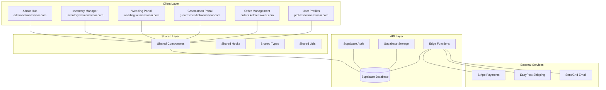
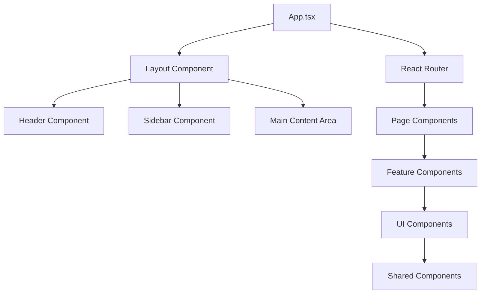
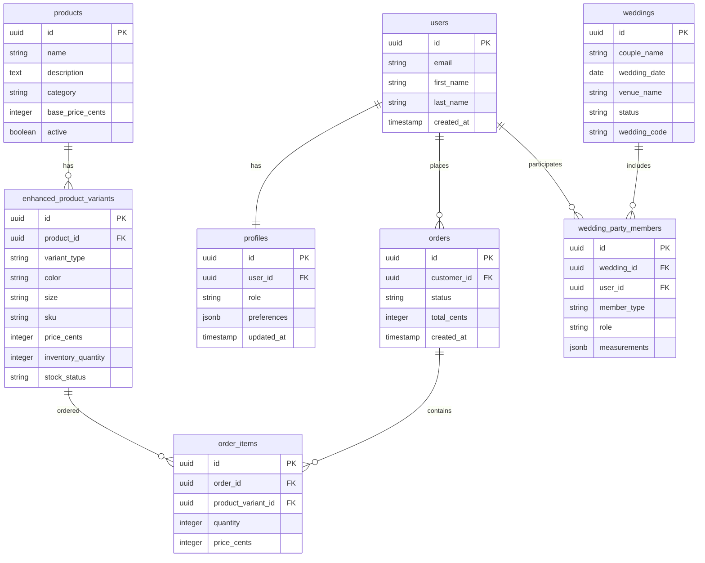
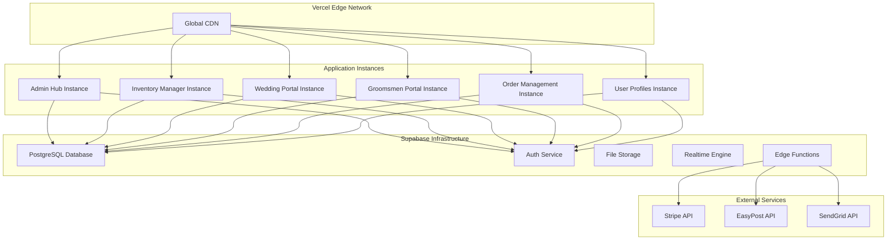
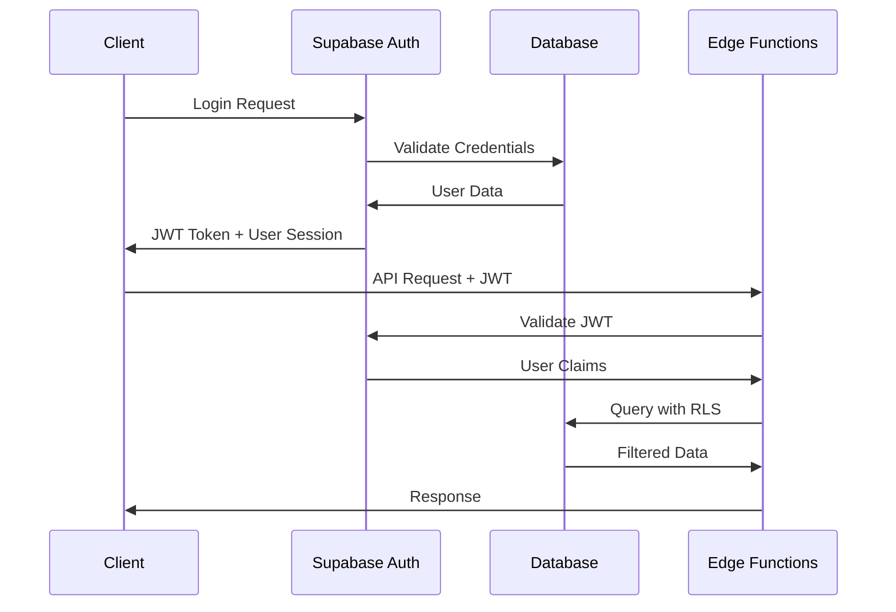

# KCT Ecosystem - Architecture Overview

## 📋 Table of Contents

1. [System Architecture](#system-architecture)
2. [Application Architecture](#application-architecture)
3. [Data Architecture](#data-architecture)
4. [Infrastructure Architecture](#infrastructure-architecture)
5. [Security Architecture](#security-architecture)
6. [Integration Architecture](#integration-architecture)
7. [Scalability Considerations](#scalability-considerations)

## System Architecture

### High-Level System Overview

The KCT ecosystem follows a **modular monorepo architecture** with six specialized applications sharing common infrastructure, components, and services. This design promotes code reuse while maintaining clear separation of concerns.



### Architecture Principles

1. **Modularity**: Each application serves a specific business function
2. **Reusability**: Shared components and utilities across applications
3. **Scalability**: Independent deployment and scaling of applications
4. **Maintainability**: Consistent patterns and conventions
5. **Security**: Defense in depth with multiple security layers
6. **Performance**: Optimized for fast loading and responsive interactions

## Application Architecture

### Frontend Architecture Pattern

Each application follows a consistent **Feature-Based Architecture** with clear separation of concerns:

```
apps/[app-name]/
├── src/
│   ├── components/          # UI components
│   │   ├── ui/             # Base UI components (buttons, inputs)
│   │   ├── forms/          # Form-specific components
│   │   └── layout/         # Layout components (header, sidebar)
│   ├── pages/              # Route-based page components
│   ├── hooks/              # Custom React hooks
│   ├── lib/                # Utility functions and configurations
│   ├── types/              # TypeScript type definitions
│   ├── contexts/           # React context providers
│   └── constants/          # Application constants
```

### Component Architecture

#### Component Hierarchy



#### Component Design Patterns

1. **Container/Presentational Pattern**
   ```typescript
   // Container Component (handles logic)
   export const ProductListContainer = () => {
     const { data: products, loading } = useProducts()
     const handleAddToCart = useCallback((product) => {
       // Business logic
     }, [])

     return (
       <ProductListPresentation 
         products={products}
         loading={loading}
         onAddToCart={handleAddToCart}
       />
     )
   }

   // Presentational Component (handles UI)
   export const ProductListPresentation = ({ 
     products, 
     loading, 
     onAddToCart 
   }) => {
     if (loading) return <LoadingSpinner />
     
     return (
       <div className="product-grid">
         {products.map(product => (
           <ProductCard 
             key={product.id} 
             product={product}
             onAddToCart={onAddToCart}
           />
         ))}
       </div>
     )
   }
   ```

2. **Higher-Order Components (HOCs)**
   ```typescript
   // Authentication HOC
   export const withAuth = <P extends object>(
     Component: React.ComponentType<P>
   ) => {
     return (props: P) => {
       const { user, loading } = useAuth()
       
       if (loading) return <LoadingSpinner />
       if (!user) return <LoginPrompt />
       
       return <Component {...props} />
     }
   }
   
   // Usage
   export const ProtectedDashboard = withAuth(Dashboard)
   ```

3. **Custom Hooks Pattern**
   ```typescript
   // Business logic encapsulation
   export const useOrderManagement = (orderId: string) => {
     const [order, setOrder] = useState<Order | null>(null)
     const [loading, setLoading] = useState(true)
     const [error, setError] = useState<string | null>(null)
     
     const updateOrderStatus = useCallback(async (status: OrderStatus) => {
       try {
         const updatedOrder = await updateOrder(orderId, { status })
         setOrder(updatedOrder)
       } catch (err) {
         setError(err.message)
       }
     }, [orderId])
     
     return { order, loading, error, updateOrderStatus }
   }
   ```

## Data Architecture

### Database Schema Architecture

#### Core Entity Relationships



### Data Access Patterns

#### 1. Repository Pattern
```typescript
// Abstract repository interface
export interface Repository<T> {
  findById(id: string): Promise<T | null>
  findMany(filters?: any): Promise<T[]>
  create(data: Partial<T>): Promise<T>
  update(id: string, data: Partial<T>): Promise<T>
  delete(id: string): Promise<void>
}

// Supabase repository implementation
export class SupabaseRepository<T> implements Repository<T> {
  constructor(
    private tableName: string,
    private supabase = supabaseClient
  ) {}

  async findById(id: string): Promise<T | null> {
    const { data, error } = await this.supabase
      .from(this.tableName)
      .select('*')
      .eq('id', id)
      .single()

    if (error) throw error
    return data
  }

  async findMany(filters = {}): Promise<T[]> {
    let query = this.supabase.from(this.tableName).select('*')
    
    Object.entries(filters).forEach(([key, value]) => {
      query = query.eq(key, value)
    })

    const { data, error } = await query
    if (error) throw error
    return data || []
  }

  // ... other methods
}

// Usage
const productRepository = new SupabaseRepository<Product>('products')
const userRepository = new SupabaseRepository<User>('users')
```

#### 2. Query Builder Pattern
```typescript
export class QueryBuilder {
  private query: any
  
  constructor(table: string) {
    this.query = supabase.from(table)
  }
  
  select(columns: string) {
    this.query = this.query.select(columns)
    return this
  }
  
  where(column: string, operator: string, value: any) {
    this.query = this.query.filter(column, operator, value)
    return this
  }
  
  orderBy(column: string, ascending = true) {
    this.query = this.query.order(column, { ascending })
    return this
  }
  
  limit(count: number) {
    this.query = this.query.limit(count)
    return this
  }
  
  async execute() {
    const { data, error } = await this.query
    if (error) throw error
    return data
  }
}

// Usage
const products = await new QueryBuilder('products')
  .select('id, name, price_cents')
  .where('category', 'eq', 'suits')
  .where('active', 'eq', true)
  .orderBy('created_at', false)
  .limit(20)
  .execute()
```

### State Management Architecture

#### React Query + Zustand Pattern

```typescript
// Global state with Zustand
interface AppStore {
  user: User | null
  cart: CartItem[]
  preferences: UserPreferences
  setUser: (user: User | null) => void
  addToCart: (item: CartItem) => void
  updatePreferences: (preferences: Partial<UserPreferences>) => void
}

export const useAppStore = create<AppStore>((set) => ({
  user: null,
  cart: [],
  preferences: defaultPreferences,
  
  setUser: (user) => set({ user }),
  
  addToCart: (item) => set((state) => ({
    cart: [...state.cart, item]
  })),
  
  updatePreferences: (preferences) => set((state) => ({
    preferences: { ...state.preferences, ...preferences }
  }))
}))

// Server state with React Query
export const useProducts = (category?: string) => {
  return useQuery({
    queryKey: ['products', category],
    queryFn: () => productRepository.findMany(
      category ? { category, active: true } : { active: true }
    ),
    staleTime: 5 * 60 * 1000, // 5 minutes
    cacheTime: 10 * 60 * 1000 // 10 minutes
  })
}

// Mutations with optimistic updates
export const useCreateOrder = () => {
  const queryClient = useQueryClient()
  
  return useMutation({
    mutationFn: (orderData: CreateOrderData) => orderRepository.create(orderData),
    
    onSuccess: (newOrder) => {
      // Invalidate related queries
      queryClient.invalidateQueries(['orders'])
      queryClient.invalidateQueries(['user-orders'])
      
      // Update cart state
      useAppStore.getState().clearCart()
    },
    
    onError: (error) => {
      console.error('Failed to create order:', error)
    }
  })
}
```

## Infrastructure Architecture

### Deployment Architecture

#### Multi-Application Deployment Pattern



### Performance Architecture

#### Caching Strategy

```typescript
// Multi-layer caching strategy
export const cacheManager = {
  // Level 1: Browser cache (React Query)
  queryCache: new QueryClient({
    defaultOptions: {
      queries: {
        staleTime: 5 * 60 * 1000, // 5 minutes
        cacheTime: 10 * 60 * 1000, // 10 minutes
        refetchOnWindowFocus: false
      }
    }
  }),

  // Level 2: Local storage cache
  localStorage: {
    set: (key: string, data: any, ttl = 3600000) => {
      const item = {
        data,
        timestamp: Date.now(),
        ttl
      }
      localStorage.setItem(key, JSON.stringify(item))
    },

    get: (key: string) => {
      const item = localStorage.getItem(key)
      if (!item) return null

      const parsed = JSON.parse(item)
      if (Date.now() - parsed.timestamp > parsed.ttl) {
        localStorage.removeItem(key)
        return null
      }

      return parsed.data
    }
  },

  // Level 3: CDN cache (Vercel Edge)
  cdnCache: {
    headers: {
      'Cache-Control': 'public, s-maxage=3600, stale-while-revalidate=86400'
    }
  }
}
```

## Security Architecture

### Authentication Flow



### Row Level Security (RLS) Implementation

```sql
-- User profile access control
CREATE POLICY "Users can view own profile" ON profiles
FOR SELECT USING (auth.uid() = user_id);

CREATE POLICY "Users can update own profile" ON profiles
FOR UPDATE USING (auth.uid() = user_id);

-- Admin access to all data
CREATE POLICY "Admins have full access" ON profiles
FOR ALL USING (
  auth.jwt() ->> 'role' = 'admin'
);

-- Wedding party member access
CREATE POLICY "Wedding party access" ON wedding_party_members
FOR SELECT USING (
  auth.uid() = user_id OR
  auth.uid() IN (
    SELECT user_id FROM wedding_party_members wpm
    WHERE wpm.wedding_id = wedding_party_members.wedding_id
    AND wpm.role = 'coordinator'
  )
);
```

## Integration Architecture

### External Service Integration Pattern

```typescript
// Service abstraction layer
export abstract class PaymentService {
  abstract createPaymentIntent(amount: number, metadata: any): Promise<PaymentIntent>
  abstract confirmPayment(paymentIntentId: string): Promise<PaymentResult>
  abstract refundPayment(paymentIntentId: string, amount?: number): Promise<RefundResult>
}

// Stripe implementation
export class StripePaymentService extends PaymentService {
  constructor(private apiKey: string) {
    super()
  }

  async createPaymentIntent(amount: number, metadata: any): Promise<PaymentIntent> {
    // Stripe-specific implementation
    const stripe = new Stripe(this.apiKey)
    return await stripe.paymentIntents.create({
      amount,
      currency: 'usd',
      metadata
    })
  }

  // ... other methods
}

// Service factory
export const createPaymentService = (): PaymentService => {
  const provider = process.env.PAYMENT_PROVIDER || 'stripe'
  
  switch (provider) {
    case 'stripe':
      return new StripePaymentService(process.env.STRIPE_SECRET_KEY!)
    default:
      throw new Error(`Unsupported payment provider: ${provider}`)
  }
}
```

### Event-Driven Architecture

```typescript
// Event bus implementation
export class EventBus {
  private listeners: Map<string, Array<(data: any) => void>> = new Map()

  subscribe(event: string, callback: (data: any) => void) {
    if (!this.listeners.has(event)) {
      this.listeners.set(event, [])
    }
    this.listeners.get(event)!.push(callback)
  }

  emit(event: string, data: any) {
    const callbacks = this.listeners.get(event) || []
    callbacks.forEach(callback => callback(data))
  }

  unsubscribe(event: string, callback: (data: any) => void) {
    const callbacks = this.listeners.get(event) || []
    const index = callbacks.indexOf(callback)
    if (index > -1) {
      callbacks.splice(index, 1)
    }
  }
}

// Global event bus
export const eventBus = new EventBus()

// Usage
eventBus.subscribe('order.created', (order) => {
  console.log('New order created:', order)
  // Send email notification
  // Update inventory
  // Log analytics
})

eventBus.emit('order.created', newOrder)
```

## Scalability Considerations

### Horizontal Scaling Strategy

1. **Application-Level Scaling**
   - Independent deployment of each application
   - Load balancing across multiple instances
   - Auto-scaling based on traffic patterns

2. **Database Scaling**
   - Read replicas for heavy read workloads
   - Connection pooling for efficient resource usage
   - Query optimization and indexing strategies

3. **Caching Strategy**
   - CDN caching for static assets
   - Application-level caching with React Query
   - Database query result caching

### Performance Monitoring

```typescript
// Performance monitoring service
export class PerformanceMonitor {
  private metrics: Map<string, number[]> = new Map()

  trackMetric(name: string, value: number) {
    if (!this.metrics.has(name)) {
      this.metrics.set(name, [])
    }
    
    const values = this.metrics.get(name)!
    values.push(value)
    
    // Keep only last 100 values
    if (values.length > 100) {
      values.shift()
    }
  }

  getAverageMetric(name: string): number {
    const values = this.metrics.get(name) || []
    if (values.length === 0) return 0
    
    const sum = values.reduce((a, b) => a + b, 0)
    return sum / values.length
  }

  trackApiCall<T>(name: string, apiCall: () => Promise<T>): Promise<T> {
    const start = performance.now()
    
    return apiCall()
      .finally(() => {
        const duration = performance.now() - start
        this.trackMetric(`api.${name}.duration`, duration)
      })
  }
}

export const performanceMonitor = new PerformanceMonitor()
```

### Future Architecture Considerations

1. **Microservices Migration Path**
   - Gradual extraction of business domains
   - API gateway implementation
   - Service mesh for inter-service communication

2. **Real-time Features Expansion**
   - WebSocket connections for live updates
   - Server-sent events for notifications
   - Real-time collaboration features

3. **Mobile Application Integration**
   - GraphQL API for efficient mobile data fetching
   - Offline-first architecture
   - Progressive Web App (PWA) capabilities

---

## Conclusion

The KCT ecosystem architecture is designed to be:

- **Scalable**: Can grow with business needs
- **Maintainable**: Clear separation of concerns and consistent patterns
- **Secure**: Multiple layers of security controls
- **Performant**: Optimized for fast loading and responsive interactions
- **Flexible**: Easy to extend and modify

This architecture provides a solid foundation for the current needs while being prepared for future growth and evolution.

---

*This document should be updated as the architecture evolves and new patterns are adopted.*