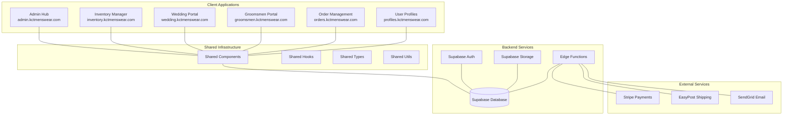

# KCT Ecosystem - Developer Onboarding Guide

Welcome to the KCT Menswear Ecosystem development team! This comprehensive guide will get you up and running with our complete business management platform, covering everything from initial setup to advanced development practices.

## 📋 Table of Contents

1. [Development Environment Setup](#1-development-environment-setup)
2. [KCT Ecosystem Architecture Overview](#2-kct-ecosystem-architecture-overview)  
3. [Codebase Structure and Navigation](#3-codebase-structure-and-navigation)
4. [Getting Started with Local Development](#4-getting-started-with-local-development)
5. [Database Setup and Seeding](#5-database-setup-and-seeding)
6. [Testing Strategies and Frameworks](#6-testing-strategies-and-frameworks)
7. [Code Quality Standards and Best Practices](#7-code-quality-standards-and-best-practices)
8. [Deployment Procedures and CI/CD](#8-deployment-procedures-and-cicd)
9. [Troubleshooting Guide](#9-troubleshooting-guide)
10. [Team Collaboration Patterns](#10-team-collaboration-patterns)
11. [Security Considerations](#11-security-considerations)
12. [Performance Optimization](#12-performance-optimization)

---

## 1. Development Environment Setup

### Prerequisites

Before diving into the KCT ecosystem, ensure your development machine has the following installed:

#### Required Software
- **Node.js 18.0+**: Download from [nodejs.org](https://nodejs.org) or use a version manager
- **pnpm**: Our preferred package manager (`npm install -g pnpm`)
- **Git**: Version control system
- **VS Code**: Recommended IDE with extensions listed below

#### Recommended VS Code Extensions
```json
{
  "recommendations": [
    "bradlc.vscode-tailwindcss",
    "esbenp.prettier-vscode",
    "dbaeumer.vscode-eslint",
    "ms-vscode.vscode-typescript-next",
    "bradlc.vscode-tailwindcss",
    "formulahendry.auto-rename-tag",
    "christian-kohler.path-intellisense",
    "ms-vscode.vscode-json"
  ]
}
```

#### Terminal Setup
For optimal development experience, configure your terminal:

**macOS/Linux:**
```bash
# Install oh-my-zsh (optional but recommended)
sh -c "$(curl -fsSL https://raw.github.com/ohmyzsh/ohmyzsh/master/tools/install.sh)"

# Install useful aliases
echo 'alias ll="ls -la"' >> ~/.zshrc
echo 'alias gs="git status"' >> ~/.zshrc
echo 'alias gc="git commit"' >> ~/.zshrc
source ~/.zshrc
```

**Windows:**
Use Windows Terminal with PowerShell or install WSL2 for the best experience.

#### Environment Configuration

Create global Git configuration:
```bash
git config --global user.name "Your Name"
git config --global user.email "your.email@kctmenswear.com"
git config --global init.defaultBranch main
```

### Development Tools Installation

#### Package Manager Setup
```bash
# Install pnpm globally
npm install -g pnpm@latest

# Verify installation
pnpm --version
node --version
```

#### Supabase CLI (Essential)
```bash
# Install Supabase CLI
npm install -g supabase

# Verify installation
supabase --version
```

#### Additional Development Tools
```bash
# Useful development tools
npm install -g @types/node typescript ts-node
npm install -g vercel  # For deployment management
```

---

## 2. KCT Ecosystem Architecture Overview

### System Architecture

The KCT ecosystem is built as a **modular monorepo** with six specialized applications, each serving specific business functions while sharing common infrastructure and components.

#### High-Level Architecture Diagram



### Application Overview

#### 1. Admin Hub (`apps/admin-hub`)
**Primary Business Dashboard**
- **Purpose**: Central command center for business operations
- **Key Features**:
  - Real-time business analytics and KPIs
  - User management and role-based permissions
  - System configuration and settings
  - Integration hub for all other applications
  - Advanced reporting and data visualization
- **Tech Stack**: React 18, TypeScript, Tailwind CSS, Recharts
- **Primary Users**: Business administrators, managers

#### 2. Inventory Manager (`apps/inventory-manager`)
**Advanced Inventory Control System**
- **Purpose**: Comprehensive inventory tracking and management
- **Key Features**:
  - Size-specific inventory tracking (suits, shirts, accessories)
  - Real-time stock updates and automated alerts
  - Bulk inventory operations and adjustments
  - Supplier management and purchase orders
  - Historical inventory tracking and analytics
- **Tech Stack**: React 18, TypeScript, Tailwind CSS
- **Primary Users**: Inventory managers, warehouse staff

#### 3. Wedding Portal (`apps/wedding-portal`)
**Wedding Management Platform**
- **Purpose**: Complete wedding coordination and management
- **Key Features**:
  - Wedding timeline and milestone tracking
  - Couple communication center with messaging
  - Outfit coordination and approval workflows
  - Wedding party member management
  - Payment processing and order tracking
- **Tech Stack**: React 18, TypeScript, Tailwind CSS, React Query
- **Primary Users**: Wedding coordinators, couples

#### 4. Groomsmen Portal (`apps/groomsmen-portal`)
**Groomsmen-Specific Interface**
- **Purpose**: Dedicated interface for groomsmen interactions
- **Key Features**:
  - Individual groomsmen dashboards with personalized views
  - Measurement submission system with guided workflows
  - Outfit selection and approval processes
  - Timeline tracking and automated reminders
  - Communication tools for coordination
- **Tech Stack**: React 18, TypeScript, Tailwind CSS
- **Primary Users**: Groomsmen, best men, wedding parties

#### 5. Order Management (`apps/order-management`)
**Order Processing Dashboard**
- **Purpose**: Complete order lifecycle management
- **Key Features**:
  - Order lifecycle tracking from creation to fulfillment
  - Payment processing and Stripe integration
  - Shipping coordination with EasyPost
  - Customer communication automation
  - Return and exchange processing
- **Tech Stack**: React 18, TypeScript, Tailwind CSS, React Query
- **Primary Users**: Order processors, customer service

#### 6. User Profiles (`apps/user-profiles`)
**Customer Profile Management**
- **Purpose**: Comprehensive customer data management
- **Key Features**:
  - Enhanced customer profiles with detailed information
  - Measurement history and size profile tracking
  - Preference management and personalization
  - Order history and purchase analytics
  - Communication preference management
- **Tech Stack**: React 18, TypeScript, Tailwind CSS
- **Primary Users**: Customer service, sales team

### Shared Infrastructure

#### Shared Components (`/shared/components`)
Reusable UI components used across all applications:
- **Form Components**: Input fields, select boxes, date pickers
- **Navigation**: Headers, sidebars, breadcrumbs
- **Data Display**: Tables, cards, modals, charts
- **Feedback**: Toasts, loading states, error boundaries

#### Shared Utilities (`/shared/utils`)
Common utility functions and helpers:
- **Data Processing**: Formatters, validators, parsers
- **API Helpers**: Request builders, response handlers
- **Business Logic**: Calculations, transformations

#### Shared Types (`/shared/types`)
TypeScript type definitions:
- **Database Models**: User, Product, Order, Wedding types
- **API Interfaces**: Request/response types
- **UI State**: Component prop types

### Database Architecture

#### Core Tables
- **users**: Authentication and basic user information
- **profiles**: Extended user profile data and preferences
- **products**: Product catalog with detailed information
- **enhanced_product_variants**: Size/color variations with inventory tracking
- **orders**: Order management with status tracking
- **weddings**: Wedding information and coordination data
- **wedding_party_members**: Individual party member details

#### Advanced Features
- **Row Level Security (RLS)**: Secure data access patterns
- **Real-time Subscriptions**: Live data updates across applications
- **Edge Functions**: Server-side business logic and integrations
- **Automated Triggers**: Business rule enforcement

### External Service Integrations

#### Stripe Payment Processing
- **Payment Links**: Automated payment generation
- **Webhook Handling**: Real-time payment status updates
- **Subscription Management**: Recurring payment processing

#### EasyPost Shipping Integration
- **Rate Shopping**: Automated carrier rate comparison
- **Label Generation**: Shipping label creation and tracking
- **Webhook Processing**: Delivery status updates

#### SendGrid Email Automation
- **Transactional Emails**: Order confirmations, shipping updates
- **Marketing Campaigns**: Customer engagement and retention
- **Template Management**: Dynamic email content generation

---

## 3. Codebase Structure and Navigation

Understanding the monorepo structure is crucial for efficient development. Here's a comprehensive breakdown:

### Monorepo Structure

```
kct-ecosystem-monorepo/
├── 📁 apps/                          # Individual applications
│   ├── 📁 admin-hub/                 # Admin dashboard
│   ├── 📁 inventory-manager/         # Inventory management
│   ├── 📁 wedding-portal/           # Wedding coordination
│   ├── 📁 groomsmen-portal/         # Groomsmen interface
│   ├── 📁 order-management/         # Order processing
│   └── 📁 user-profiles/            # Customer profiles
├── 📁 shared/                        # Shared resources
│   ├── 📁 components/               # Reusable UI components
│   ├── 📁 utils/                    # Shared utilities
│   ├── 📁 types/                    # TypeScript definitions
│   ├── 📁 hooks/                    # Custom React hooks
│   ├── 📁 constants/                # Application constants
│   ├── 📁 styles/                   # Global styles and themes
│   └── 📁 supabase/                # Supabase configuration
├── 📁 docs/                         # Documentation
│   ├── 📁 developer/                # Developer guides
│   ├── 📁 api/                      # API documentation
│   ├── 📁 database/                 # Database schemas
│   └── 📁 deployment/               # Deployment guides
├── 📁 deployment/                    # Deployment configurations
│   ├── vercel-admin-hub.json
│   ├── vercel-inventory-manager.json
│   └── ... (other Vercel configs)
├── 📄 package.json                  # Root package configuration
├── 📄 README.md                     # Project overview
└── 📄 DEPLOYMENT.md                 # Deployment instructions
```

### Individual Application Structure

Each application follows a consistent structure:

```
apps/[app-name]/
├── 📁 public/                       # Static assets
│   ├── favicon.ico
│   └── manifest.json
├── 📁 src/                         # Source code
│   ├── 📁 components/              # App-specific components
│   │   ├── 📁 ui/                  # Base UI components
│   │   ├── 📁 forms/               # Form components
│   │   └── 📁 layout/              # Layout components
│   ├── 📁 pages/                   # Route components
│   ├── 📁 hooks/                   # Custom hooks
│   ├── 📁 lib/                     # Utility functions
│   ├── 📁 types/                   # App-specific types
│   ├── 📁 contexts/                # React contexts
│   ├── 📄 App.tsx                  # Main app component
│   ├── 📄 main.tsx                 # Entry point
│   └── 📄 index.css                # Styles
├── 📄 package.json                 # App dependencies
├── 📄 vite.config.ts              # Vite configuration
├── 📄 tailwind.config.js          # Tailwind CSS config
├── 📄 tsconfig.json               # TypeScript config
└── 📄 README.md                   # App-specific readme
```

### Key Navigation Patterns

#### Finding Components
1. **Shared Components**: Look in `/shared/components/` first
2. **App-Specific Components**: Check `apps/[app-name]/src/components/`
3. **UI Components**: Usually in `components/ui/` (shadcn/ui components)

#### Locating Business Logic
1. **Custom Hooks**: Check `src/hooks/` or `/shared/hooks/`
2. **Utilities**: Look in `src/lib/` or `/shared/utils/`
3. **API Integration**: Usually in `src/lib/supabase.ts` or similar

#### Database-Related Files
1. **Migrations**: `/supabase/migrations/`
2. **Edge Functions**: `/supabase/functions/`
3. **Table Definitions**: `/supabase/tables/`

### Navigation Tips

#### VS Code Shortcuts
- `Ctrl+P` (or `Cmd+P`): Quick file finder
- `Ctrl+Shift+F`: Search across all files
- `F12`: Go to definition
- `Shift+F12`: Find all references

#### Useful Search Patterns
```bash
# Find all components with "Button" in name
find . -name "*Button*" -type f

# Search for specific function usage
grep -r "useAuth" apps/

# Find all TypeScript files
find . -name "*.ts" -o -name "*.tsx"
```

---

## 4. Getting Started with Local Development

This section provides step-by-step instructions for setting up each application in your local development environment.

### Initial Repository Setup

#### 1. Clone the Repository
```bash
# Clone the main repository
git clone https://github.com/IbrahimAyad/max-out-admin.git kct-ecosystem
cd kct-ecosystem

# Navigate to the monorepo
cd kct-ecosystem-monorepo
```

#### 2. Install Root Dependencies
```bash
# Install root-level dependencies
pnpm install

# Install all application dependencies
pnpm run install:all
```

### Environment Configuration

#### 1. Supabase Setup
First, you'll need access to the Supabase project:

```bash
# Create environment files for each app
cp apps/admin-hub/.env.example apps/admin-hub/.env.local
cp apps/inventory-manager/.env.example apps/inventory-manager/.env.local
# ... repeat for all apps
```

#### 2. Environment Variables
Each application needs the following environment variables:

```env
# .env.local (for each app)
VITE_SUPABASE_URL=https://your-project.supabase.co
VITE_SUPABASE_ANON_KEY=your-anon-key

# Optional: Additional service configurations
VITE_STRIPE_PUBLIC_KEY=pk_test_your_stripe_key
VITE_EASYPOST_API_KEY=your_easypost_key
```

> **Security Note**: Never commit `.env.local` files. They're already in `.gitignore`.

### Application-Specific Setup

#### Admin Hub Development
```bash
# Navigate to admin hub
cd apps/admin-hub

# Install dependencies (if not done globally)
pnpm install

# Start development server
pnpm run dev

# Open in browser
# http://localhost:5173
```

**Key Features to Test:**
- Dashboard loads with analytics widgets
- User management interface is accessible
- Navigation between sections works
- Charts and data visualizations render correctly

#### Inventory Manager Development
```bash
# Navigate to inventory manager
cd apps/inventory-manager

# Start development server
pnpm run dev

# Open in browser
# http://localhost:5174 (note different port)
```

**Key Features to Test:**
- Product catalog displays correctly
- Inventory levels show accurate data
- Stock adjustment functionality works
- Search and filtering operate properly

#### Wedding Portal Development
```bash
# Navigate to wedding portal
cd apps/wedding-portal

# Start development server
pnpm run dev

# Open in browser
# http://localhost:5175
```

**Key Features to Test:**
- Wedding timeline displays correctly
- Couple dashboard functionality
- Communication features work
- File upload capabilities function

#### Groomsmen Portal Development
```bash
# Navigate to groomsmen portal
cd apps/groomsmen-portal

# Start development server
pnpm run dev

# Open in browser
# http://localhost:5176
```

**Key Features to Test:**
- Individual groomsmen login works
- Measurement submission flows
- Outfit selection interface
- Timeline and reminder system

#### Order Management Development
```bash
# Navigate to order management
cd apps/order-management

# Start development server
pnpm run dev

# Open in browser
# http://localhost:5177
```

**Key Features to Test:**
- Order list displays correctly
- Order detail views show complete information
- Status updates function properly
- Payment and shipping integration works

#### User Profiles Development
```bash
# Navigate to user profiles
cd apps/user-profiles

# Start development server
pnpm run dev

# Open in browser
# http://localhost:5178
```

**Key Features to Test:**
- Profile creation and editing
- Measurement history tracking
- Order history displays correctly
- Preference management functions

### Development Workflow

#### Running Multiple Applications
For comprehensive testing, you can run multiple applications simultaneously:

```bash
# Terminal 1: Admin Hub
cd apps/admin-hub && pnpm run dev

# Terminal 2: Wedding Portal
cd apps/wedding-portal && pnpm run dev

# Terminal 3: Groomsmen Portal
cd apps/groomsmen-portal && pnpm run dev
```

#### Using Concurrent Development
Create a script for running multiple apps:

```bash
# In package.json root scripts
"dev:multiple": "concurrently \"cd apps/admin-hub && pnpm run dev\" \"cd apps/wedding-portal && pnpm run dev\" \"cd apps/groomsmen-portal && pnpm run dev\""
```

### Hot Reloading and Development Server

#### Vite Configuration
Each application uses Vite for fast development and hot reloading:

```typescript
// vite.config.ts
import { defineConfig } from 'vite'
import react from '@vitejs/plugin-react'
import path from 'path'

export default defineConfig({
  plugins: [react()],
  server: {
    port: 5173, // Unique port per app
    host: true,
    strictPort: true
  },
  resolve: {
    alias: {
      "@": path.resolve(__dirname, "./src"),
      "@shared": path.resolve(__dirname, "../../shared")
    }
  }
})
```

#### Development Best Practices
- Use unique ports for each application
- Enable host binding for network access
- Configure path aliases for clean imports
- Use strict port mode to avoid conflicts

### Testing Your Setup

#### Quick Health Check
Create a simple health check script:

```bash
#!/bin/bash
# health-check.sh

echo "🏥 KCT Ecosystem Health Check"
echo "================================"

# Check Node.js version
echo "Node.js version: $(node --version)"

# Check pnpm version
echo "pnpm version: $(pnpm --version)"

# Check if Supabase CLI is installed
if command -v supabase &> /dev/null; then
    echo "Supabase CLI: ✅ Installed"
else
    echo "Supabase CLI: ❌ Not installed"
fi

# Check environment files
for app in admin-hub inventory-manager wedding-portal groomsmen-portal order-management user-profiles; do
    if [ -f "apps/$app/.env.local" ]; then
        echo "$app environment: ✅ Configured"
    else
        echo "$app environment: ❌ Missing .env.local"
    fi
done

echo "================================"
echo "Setup complete! 🚀"
```

---

## 5. Database Setup and Seeding

The KCT ecosystem uses Supabase as its primary database and backend service. This section covers complete database setup, schema management, and data seeding procedures.

### Supabase Project Setup

#### 1. Initial Supabase Configuration
```bash
# Navigate to project root
cd kct-ecosystem-monorepo

# Initialize Supabase (if not already done)
supabase init

# Link to existing project
supabase link --project-ref your-project-reference

# Pull existing schema
supabase db pull
```

#### 2. Environment Configuration
```bash
# Create local Supabase configuration
supabase start

# This will start local Supabase services:
# - Database (PostgreSQL)
# - API Gateway
# - Auth Service
# - Storage Service
# - Dashboard
```

### Database Schema Overview

#### Core Tables Structure

```sql
-- Core authentication and user management
users                     -- Supabase Auth users
profiles                  -- Extended user profiles
user_roles               -- Role-based access control

-- Product catalog and inventory
products                 -- Master product catalog  
enhanced_product_variants -- Size/color variations with inventory
sizing_categories        -- Size definitions for different products
inventory_history        -- Audit trail for inventory changes
low_stock_alerts        -- Automated stock monitoring

-- Order management
orders                   -- Order records and processing
order_items             -- Individual items within orders
order_status_history    -- Order status tracking
payment_records         -- Payment processing records

-- Wedding management
weddings                -- Wedding coordination data
wedding_party_members   -- Individual party member details
wedding_measurements    -- Size and measurement tracking
wedding_communications  -- Message and notification history
wedding_timeline        -- Event scheduling and milestones

-- System features
email_logs             -- Email delivery tracking
admin_notifications    -- System alerts and notices
shipping_templates     -- Shipping configuration templates
```

#### Advanced Database Features

**Row Level Security (RLS)**
All tables implement RLS policies for secure data access:
```sql
-- Example RLS policy
CREATE POLICY "Users can view their own profile" ON profiles
    FOR SELECT USING (auth.uid() = user_id);
```

**Real-time Subscriptions**
Tables configured for real-time updates:
- `orders` - Live order status updates
- `inventory` - Stock level changes
- `wedding_communications` - Instant messaging

### Migration Management

#### Running Migrations
```bash
# Apply all pending migrations
supabase db push

# Create a new migration
supabase migration new your_migration_name

# Reset database (development only)
supabase db reset
```

#### Migration Best Practices

**1. Migration File Structure**
```sql
-- Migration: [timestamp]_descriptive_name.sql
-- Description: Brief description of changes
-- Created: YYYY-MM-DD

-- Drop statements (if needed)
DROP TABLE IF EXISTS old_table CASCADE;

-- Create statements
CREATE TABLE new_table (
    id UUID PRIMARY KEY DEFAULT gen_random_uuid(),
    -- ... other columns
    created_at TIMESTAMPTZ DEFAULT NOW(),
    updated_at TIMESTAMPTZ DEFAULT NOW()
);

-- Index creation
CREATE INDEX idx_new_table_column ON new_table(column_name);

-- RLS policies
ALTER TABLE new_table ENABLE ROW LEVEL SECURITY;
CREATE POLICY "policy_name" ON new_table FOR ALL USING (true);

-- Insert seed data (if appropriate)
INSERT INTO new_table (name, value) VALUES 
    ('example', 'value');
```

**2. Schema Validation**
```bash
# Validate schema changes
supabase db diff

# Generate TypeScript types
supabase gen types typescript --local > shared/types/supabase.ts
```

### Data Seeding Procedures

#### 1. Product Catalog Seeding

**Sizing Categories Setup**
```sql
-- Insert standard menswear sizing categories
INSERT INTO sizing_categories (name, description, sizes) VALUES
('suits', 'Suit sizing with S/R/L system', 
 '["34S", "34R", "36S", "36R", "38S", "38R", "38L", "40S", "40R", "40L", "42S", "42R", "42L", "44S", "44R", "44L", "46S", "46R", "46L", "48S", "48R", "48L", "50S", "50R", "50L", "52R", "52L", "54R", "54L"]'),
('dress_shirts', 'Dress shirt collar sizes', 
 '["14.5", "15", "15.5", "16", "16.5", "17", "17.5", "18"]'),
('ties', 'Tie length options', 
 '["Regular", "Extra Long"]'),
('shoes', 'Shoe sizes', 
 '["7", "7.5", "8", "8.5", "9", "9.5", "10", "10.5", "11", "11.5", "12", "12.5", "13"]');
```

**Sample Product Data**
```sql
-- Insert sample products
INSERT INTO products (name, description, category, base_price_cents) VALUES
('Classic Navy Suit', 'Two-piece navy business suit', 'suits', 89900),
('Charcoal Grey Suit', 'Three-piece charcoal suit', 'suits', 109900),
('White Dress Shirt', 'Classic white cotton dress shirt', 'shirts', 7900),
('Silk Tie - Navy', 'Premium silk tie in navy', 'accessories', 4900);
```

#### 2. User and Role Seeding

**Admin User Setup**
```sql
-- Create admin roles
INSERT INTO user_roles (name, description, permissions) VALUES
('admin', 'Full system administrator', '["all"]'),
('manager', 'Business manager', '["read", "write", "manage_orders"]'),
('staff', 'General staff member', '["read", "process_orders"]');

-- Create sample admin user (after authentication)
INSERT INTO profiles (user_id, role, first_name, last_name, email) VALUES
('admin-uuid-here', 'admin', 'System', 'Administrator', 'admin@kctmenswear.com');
```

#### 3. Wedding Data Seeding

**Sample Wedding Setup**
```sql
-- Insert sample wedding
INSERT INTO weddings (
    couple_name, 
    wedding_date, 
    venue_name, 
    status, 
    wedding_code
) VALUES
('Smith-Johnson Wedding', '2025-06-15', 'Grand Ballroom', 'planning', 'SJ2025');

-- Insert wedding party members
INSERT INTO wedding_party_members (
    wedding_id,
    member_type,
    first_name,
    last_name,
    email,
    role
) VALUES
((SELECT id FROM weddings WHERE wedding_code = 'SJ2025'), 
 'groomsmen', 'John', 'Doe', 'john@example.com', 'groomsman');
```

### Database Seeding Scripts

#### Automated Seeding Script
Create a comprehensive seeding script:

```bash
#!/bin/bash
# seed-database.sh

echo "🌱 Seeding KCT Ecosystem Database"
echo "=================================="

# Apply base schema
echo "Applying base schema..."
supabase db reset --local

# Seed sizing categories
echo "Seeding sizing categories..."
psql -h localhost -p 54322 -d postgres -U postgres -f seeds/01-sizing-categories.sql

# Seed sample products  
echo "Seeding sample products..."
psql -h localhost -p 54322 -d postgres -U postgres -f seeds/02-products.sql

# Seed user roles and permissions
echo "Seeding user roles..."
psql -h localhost -p 54322 -d postgres -U postgres -f seeds/03-user-roles.sql

# Seed sample weddings
echo "Seeding sample weddings..."
psql -h localhost -p 54322 -d postgres -U postgres -f seeds/04-weddings.sql

echo "=================================="
echo "Database seeding complete! ✅"
```

#### Development Data Reset
```bash
#!/bin/bash
# reset-dev-data.sh

echo "🔄 Resetting development data..."

# Reset database
supabase db reset --local

# Re-run seeding
./seed-database.sh

echo "Development data reset complete! ✅"
```

### Edge Functions Setup

#### 1. Function Development
```bash
# Create new edge function
supabase functions new function-name

# Develop function locally
supabase functions serve

# Deploy function
supabase functions deploy function-name
```

#### 2. Key Edge Functions

**Order Processing Function**
```typescript
// supabase/functions/order-management/index.ts
import { serve } from "https://deno.land/std@0.168.0/http/server.ts"

serve(async (req) => {
  try {
    const { action, orderId, data } = await req.json()
    
    switch (action) {
      case 'create':
        // Handle order creation
        break
      case 'update_status':
        // Handle status updates
        break
      default:
        throw new Error('Invalid action')
    }
    
    return new Response(
      JSON.stringify({ success: true }),
      { headers: { "Content-Type": "application/json" } }
    )
  } catch (error) {
    return new Response(
      JSON.stringify({ error: error.message }),
      { status: 400, headers: { "Content-Type": "application/json" } }
    )
  }
})
```

### Database Monitoring and Maintenance

#### Health Checks
```sql
-- Monitor database performance
SELECT 
    schemaname,
    tablename,
    n_tup_ins as inserts,
    n_tup_upd as updates,
    n_tup_del as deletes
FROM pg_stat_user_tables
ORDER BY n_tup_ins DESC;

-- Check table sizes
SELECT 
    schemaname,
    tablename,
    pg_size_pretty(pg_total_relation_size(tablename::regclass)) as size
FROM pg_tables
WHERE schemaname = 'public'
ORDER BY pg_total_relation_size(tablename::regclass) DESC;
```

#### Backup Procedures
```bash
# Create database backup
supabase db dump > backup-$(date +%Y%m%d).sql

# Restore from backup
supabase db reset
psql -h localhost -p 54322 -d postgres -U postgres < backup-20250819.sql
```

---

## 6. Testing Strategies and Frameworks

Comprehensive testing ensures the reliability and maintainability of the KCT ecosystem. This section outlines our testing philosophy, tools, and implementation strategies.

### Testing Philosophy

#### Testing Pyramid
Our testing strategy follows the testing pyramid principle:

1. **Unit Tests (70%)**: Fast, isolated tests for individual functions and components
2. **Integration Tests (20%)**: Tests for component interactions and API integrations  
3. **End-to-End Tests (10%)**: Full user journey testing across applications

#### Testing Principles
- **Test-Driven Development (TDD)**: Write tests before implementation when possible
- **Behavioral Testing**: Focus on what the code should do, not how it does it
- **Continuous Testing**: Automated tests run on every commit
- **Quality Gates**: Tests must pass before deployment

### Testing Framework Setup

#### Core Testing Dependencies
```json
{
  "devDependencies": {
    "@testing-library/react": "^14.0.0",
    "@testing-library/jest-dom": "^6.0.0", 
    "@testing-library/user-event": "^14.0.0",
    "vitest": "^1.0.0",
    "jsdom": "^23.0.0",
    "msw": "^2.0.0",
    "playwright": "^1.40.0"
  }
}
```

#### Vitest Configuration
```typescript
// vitest.config.ts
import { defineConfig } from 'vitest/config'
import react from '@vitejs/plugin-react'
import path from 'path'

export default defineConfig({
  plugins: [react()],
  test: {
    globals: true,
    environment: 'jsdom',
    setupFiles: ['./src/test/setup.ts'],
    css: true,
    coverage: {
      reporter: ['text', 'json', 'html'],
      exclude: [
        'node_modules/',
        'src/test/',
        '**/*.d.ts',
        '**/*.config.*'
      ]
    }
  },
  resolve: {
    alias: {
      '@': path.resolve(__dirname, './src'),
      '@shared': path.resolve(__dirname, '../../shared')
    }
  }
})
```

#### Test Setup Configuration
```typescript
// src/test/setup.ts
import '@testing-library/jest-dom'
import { cleanup } from '@testing-library/react'
import { afterEach, vi } from 'vitest'

// Cleanup after each test case
afterEach(() => {
  cleanup()
})

// Mock Supabase client
vi.mock('@/lib/supabase', () => ({
  supabase: {
    auth: {
      getUser: vi.fn(),
      signIn: vi.fn(),
      signOut: vi.fn()
    },
    from: vi.fn(() => ({
      select: vi.fn().mockResolvedValue({ data: [], error: null }),
      insert: vi.fn().mockResolvedValue({ data: {}, error: null }),
      update: vi.fn().mockResolvedValue({ data: {}, error: null }),
      delete: vi.fn().mockResolvedValue({ data: {}, error: null })
    }))
  }
}))
```

### Unit Testing Implementation

#### Component Testing
```typescript
// src/components/ProductCard.test.tsx
import { render, screen } from '@testing-library/react'
import userEvent from '@testing-library/user-event'
import { describe, it, expect, vi } from 'vitest'
import { ProductCard } from './ProductCard'

const mockProduct = {
  id: '1',
  name: 'Classic Navy Suit',
  price: 899.00,
  description: 'Premium navy business suit',
  image_url: '/images/navy-suit.jpg'
}

describe('ProductCard', () => {
  it('renders product information correctly', () => {
    render(<ProductCard product={mockProduct} />)
    
    expect(screen.getByText('Classic Navy Suit')).toBeInTheDocument()
    expect(screen.getByText('$899.00')).toBeInTheDocument()
    expect(screen.getByText('Premium navy business suit')).toBeInTheDocument()
  })

  it('handles add to cart click', async () => {
    const mockOnAddToCart = vi.fn()
    const user = userEvent.setup()
    
    render(
      <ProductCard 
        product={mockProduct} 
        onAddToCart={mockOnAddToCart} 
      />
    )
    
    await user.click(screen.getByRole('button', { name: /add to cart/i }))
    
    expect(mockOnAddToCart).toHaveBeenCalledWith(mockProduct)
  })

  it('displays out of stock message when applicable', () => {
    const outOfStockProduct = { ...mockProduct, stock_quantity: 0 }
    
    render(<ProductCard product={outOfStockProduct} />)
    
    expect(screen.getByText('Out of Stock')).toBeInTheDocument()
    expect(screen.getByRole('button', { name: /add to cart/i }))
      .toBeDisabled()
  })
})
```

#### Hook Testing
```typescript
// src/hooks/useAuth.test.ts
import { renderHook, act } from '@testing-library/react'
import { describe, it, expect, vi } from 'vitest'
import { useAuth } from './useAuth'

// Mock the auth context
vi.mock('@/contexts/AuthContext', () => ({
  useAuthContext: () => ({
    user: null,
    signIn: vi.fn(),
    signOut: vi.fn(),
    loading: false
  })
}))

describe('useAuth', () => {
  it('returns auth state correctly', () => {
    const { result } = renderHook(() => useAuth())
    
    expect(result.current.user).toBeNull()
    expect(result.current.loading).toBe(false)
    expect(typeof result.current.signIn).toBe('function')
    expect(typeof result.current.signOut).toBe('function')
  })
})
```

#### Utility Function Testing
```typescript
// src/utils/formatters.test.ts
import { describe, it, expect } from 'vitest'
import { formatPrice, formatDate, formatPhoneNumber } from './formatters'

describe('formatters', () => {
  describe('formatPrice', () => {
    it('formats price correctly with cents', () => {
      expect(formatPrice(89900)).toBe('$899.00')
      expect(formatPrice(12345)).toBe('$123.45')
    })

    it('handles zero price', () => {
      expect(formatPrice(0)).toBe('$0.00')
    })
  })

  describe('formatDate', () => {
    it('formats date in correct format', () => {
      const date = new Date('2025-06-15T10:30:00Z')
      expect(formatDate(date)).toBe('June 15, 2025')
    })
  })

  describe('formatPhoneNumber', () => {
    it('formats US phone numbers', () => {
      expect(formatPhoneNumber('1234567890')).toBe('(123) 456-7890')
      expect(formatPhoneNumber('+11234567890')).toBe('(123) 456-7890')
    })

    it('handles invalid phone numbers', () => {
      expect(formatPhoneNumber('invalid')).toBe('invalid')
      expect(formatPhoneNumber('')).toBe('')
    })
  })
})
```

### Integration Testing

#### API Integration Testing
```typescript
// src/lib/api.test.ts
import { describe, it, expect, beforeEach, afterEach } from 'vitest'
import { http, HttpResponse } from 'msw'
import { setupServer } from 'msw/node'
import { getProducts, createOrder } from './api'

const server = setupServer(
  // Mock product API
  http.get('/api/products', () => {
    return HttpResponse.json({
      data: [
        { id: '1', name: 'Navy Suit', price: 89900 },
        { id: '2', name: 'Charcoal Suit', price: 109900 }
      ]
    })
  }),
  
  // Mock order creation API
  http.post('/api/orders', async ({ request }) => {
    const body = await request.json()
    return HttpResponse.json({
      data: { id: 'order-123', ...body }
    })
  })
)

beforeEach(() => server.listen())
afterEach(() => server.resetHandlers())

describe('API Integration', () => {
  describe('getProducts', () => {
    it('fetches products successfully', async () => {
      const products = await getProducts()
      
      expect(products).toHaveLength(2)
      expect(products[0].name).toBe('Navy Suit')
      expect(products[1].name).toBe('Charcoal Suit')
    })
  })

  describe('createOrder', () => {
    it('creates order successfully', async () => {
      const orderData = {
        customer_id: 'user-123',
        items: [
          { product_id: '1', quantity: 1, price: 89900 }
        ]
      }
      
      const order = await createOrder(orderData)
      
      expect(order.id).toBe('order-123')
      expect(order.customer_id).toBe('user-123')
    })
  })
})
```

#### Component Integration Testing
```typescript
// src/pages/ProductCatalog.test.tsx
import { render, screen, waitFor } from '@testing-library/react'
import userEvent from '@testing-library/user-event'
import { QueryClient, QueryClientProvider } from '@tanstack/react-query'
import { describe, it, expect } from 'vitest'
import { ProductCatalog } from './ProductCatalog'

const createTestQueryClient = () => new QueryClient({
  defaultOptions: {
    queries: { retry: false },
    mutations: { retry: false }
  }
})

const renderWithQueryClient = (ui: React.ReactElement) => {
  const queryClient = createTestQueryClient()
  return render(
    <QueryClientProvider client={queryClient}>
      {ui}
    </QueryClientProvider>
  )
}

describe('ProductCatalog Integration', () => {
  it('loads and displays products', async () => {
    renderWithQueryClient(<ProductCatalog />)
    
    // Should show loading state initially
    expect(screen.getByText('Loading products...')).toBeInTheDocument()
    
    // Wait for products to load
    await waitFor(() => {
      expect(screen.getByText('Navy Suit')).toBeInTheDocument()
      expect(screen.getByText('Charcoal Suit')).toBeInTheDocument()
    })
  })

  it('filters products by category', async () => {
    const user = userEvent.setup()
    renderWithQueryClient(<ProductCatalog />)
    
    await waitFor(() => {
      expect(screen.getByText('Navy Suit')).toBeInTheDocument()
    })
    
    // Click suits filter
    await user.click(screen.getByRole('button', { name: /suits/i }))
    
    // Should only show suits
    expect(screen.getByText('Navy Suit')).toBeInTheDocument()
    expect(screen.getByText('Charcoal Suit')).toBeInTheDocument()
  })
})
```

### End-to-End Testing

#### Playwright Setup
```typescript
// playwright.config.ts
import { defineConfig, devices } from '@playwright/test'

export default defineConfig({
  testDir: './e2e',
  fullyParallel: true,
  forbidOnly: !!process.env.CI,
  retries: process.env.CI ? 2 : 0,
  workers: process.env.CI ? 1 : undefined,
  reporter: 'html',
  use: {
    baseURL: 'http://localhost:5173',
    trace: 'on-first-retry',
    screenshot: 'only-on-failure'
  },
  projects: [
    {
      name: 'chromium',
      use: { ...devices['Desktop Chrome'] }
    },
    {
      name: 'firefox',
      use: { ...devices['Desktop Firefox'] }
    },
    {
      name: 'webkit',
      use: { ...devices['Desktop Safari'] }
    }
  ],
  webServer: {
    command: 'npm run dev',
    url: 'http://localhost:5173',
    reuseExistingServer: !process.env.CI
  }
})
```

#### E2E Test Examples
```typescript
// e2e/admin-dashboard.spec.ts
import { test, expect } from '@playwright/test'

test.describe('Admin Dashboard', () => {
  test.beforeEach(async ({ page }) => {
    // Login as admin user
    await page.goto('/login')
    await page.fill('[data-testid="email"]', 'admin@kctmenswear.com')
    await page.fill('[data-testid="password"]', 'admin123')
    await page.click('[data-testid="login-button"]')
    await expect(page).toHaveURL('/dashboard')
  })

  test('displays dashboard metrics correctly', async ({ page }) => {
    // Check key metrics are visible
    await expect(page.locator('[data-testid="total-orders"]')).toBeVisible()
    await expect(page.locator('[data-testid="revenue"]')).toBeVisible()
    await expect(page.locator('[data-testid="active-weddings"]')).toBeVisible()
    
    // Verify metrics have actual values
    const totalOrders = await page.locator('[data-testid="total-orders"] .metric-value').textContent()
    expect(Number(totalOrders)).toBeGreaterThanOrEqual(0)
  })

  test('navigation between sections works', async ({ page }) => {
    // Test navigation to orders section
    await page.click('[data-testid="nav-orders"]')
    await expect(page).toHaveURL('/orders')
    await expect(page.locator('h1')).toHaveText('Orders')

    // Test navigation to products section  
    await page.click('[data-testid="nav-products"]')
    await expect(page).toHaveURL('/products')
    await expect(page.locator('h1')).toHaveText('Products')
  })
})
```

```typescript
// e2e/wedding-flow.spec.ts
import { test, expect } from '@playwright/test'

test.describe('Wedding Management Flow', () => {
  test('complete wedding creation and groomsmen invitation', async ({ page }) => {
    // Login to wedding portal
    await page.goto('/wedding/login')
    await page.fill('[data-testid="wedding-code"]', 'TEST2025')
    await page.click('[data-testid="access-button"]')

    // Create new wedding
    await page.click('[data-testid="create-wedding"]')
    await page.fill('[data-testid="couple-name"]', 'Test Wedding')
    await page.fill('[data-testid="wedding-date"]', '2025-12-31')
    await page.fill('[data-testid="venue"]', 'Test Venue')
    await page.click('[data-testid="save-wedding"]')

    // Verify wedding created
    await expect(page.locator('[data-testid="success-message"]')).toBeVisible()

    // Add groomsmen
    await page.click('[data-testid="add-groomsmen"]')
    await page.fill('[data-testid="groomsman-name"]', 'John Doe')
    await page.fill('[data-testid="groomsman-email"]', 'john@example.com')
    await page.click('[data-testid="send-invitation"]')

    // Verify invitation sent
    await expect(page.locator('[data-testid="invitation-sent"]')).toBeVisible()
  })
})
```

### Testing Automation and CI/CD

#### GitHub Actions Workflow
```yaml
# .github/workflows/test.yml
name: Test Suite

on:
  push:
    branches: [ main, develop ]
  pull_request:
    branches: [ main ]

jobs:
  unit-tests:
    runs-on: ubuntu-latest
    steps:
      - uses: actions/checkout@v4
      - uses: actions/setup-node@v4
        with:
          node-version: '18'
          cache: 'pnpm'
      
      - name: Install dependencies
        run: pnpm install

      - name: Run unit tests
        run: pnpm run test:unit --coverage

      - name: Upload coverage
        uses: codecov/codecov-action@v3

  e2e-tests:
    runs-on: ubuntu-latest
    steps:
      - uses: actions/checkout@v4
      - uses: actions/setup-node@v4
        with:
          node-version: '18'
          cache: 'pnpm'

      - name: Install dependencies
        run: pnpm install

      - name: Install Playwright
        run: npx playwright install --with-deps

      - name: Start Supabase
        run: supabase start

      - name: Run E2E tests
        run: pnpm run test:e2e

      - name: Upload test results
        uses: actions/upload-artifact@v3
        if: always()
        with:
          name: playwright-report
          path: playwright-report/
```

#### Test Scripts
```json
{
  "scripts": {
    "test": "vitest",
    "test:unit": "vitest run --coverage",
    "test:watch": "vitest --watch",
    "test:e2e": "playwright test",
    "test:e2e:ui": "playwright test --ui",
    "test:all": "pnpm run test:unit && pnpm run test:e2e"
  }
}
```

### Testing Best Practices

#### Writing Effective Tests
1. **Descriptive Test Names**: Use clear, descriptive test names that explain the expected behavior
2. **Arrange-Act-Assert Pattern**: Structure tests with clear setup, execution, and verification phases
3. **Test Isolation**: Each test should be independent and not rely on other tests
4. **Mock External Dependencies**: Mock API calls, database connections, and third-party services
5. **Test Edge Cases**: Include tests for error conditions and boundary cases

#### Code Coverage Goals
- **Minimum Coverage**: 80% overall code coverage
- **Critical Paths**: 95% coverage for business logic and critical features
- **UI Components**: 70% coverage focusing on user interactions
- **Utility Functions**: 100% coverage for pure functions

#### Testing Checklist
- [ ] Unit tests for all new components and functions
- [ ] Integration tests for API endpoints and data flows
- [ ] E2E tests for critical user journeys
- [ ] Error handling and edge case coverage
- [ ] Performance testing for data-heavy operations
- [ ] Accessibility testing with screen readers
- [ ] Mobile responsiveness testing
- [ ] Cross-browser compatibility testing

## 7. Code Quality Standards and Best Practices

Maintaining high code quality is essential for the long-term success of the KCT ecosystem. This section outlines our coding standards, best practices, and quality assurance processes.

### Code Style and Formatting

#### ESLint Configuration
```typescript
// eslint.config.js
import js from '@eslint/js'
import globals from 'globals'
import reactHooks from 'eslint-plugin-react-hooks'
import reactRefresh from 'eslint-plugin-react-refresh'
import tseslint from 'typescript-eslint'

export default tseslint.config(
  { ignores: ['dist'] },
  {
    extends: [js.configs.recommended, ...tseslint.configs.recommended],
    files: ['**/*.{ts,tsx}'],
    languageOptions: {
      ecmaVersion: 2020,
      globals: globals.browser,
    },
    plugins: {
      'react-hooks': reactHooks,
      'react-refresh': reactRefresh,
    },
    rules: {
      ...reactHooks.configs.recommended.rules,
      'react-refresh/only-export-components': [
        'warn',
        { allowConstantExport: true },
      ],
      // Custom rules for KCT ecosystem
      '@typescript-eslint/no-unused-vars': ['error', { argsIgnorePattern: '^_' }],
      '@typescript-eslint/explicit-function-return-type': 'off',
      '@typescript-eslint/explicit-module-boundary-types': 'off',
      '@typescript-eslint/no-explicit-any': 'warn',
      'prefer-const': 'error',
      'no-var': 'error',
    },
  },
)
```

### TypeScript Best Practices

#### Type Definitions
```typescript
// shared/types/common.ts
export interface BaseEntity {
  id: string
  created_at: string
  updated_at: string
}

export interface User extends BaseEntity {
  email: string
  first_name: string
  last_name: string
  role: UserRole
}

export type UserRole = 'admin' | 'manager' | 'staff' | 'customer'
```

### React Best Practices

#### Component Structure
```typescript
// Good component structure example
interface OrderSummaryProps {
  orderId: string
  className?: string
}

export const OrderSummary: React.FC<OrderSummaryProps> = ({
  orderId,
  className,
}) => {
  // 1. Hooks at the top
  const { data: order, loading, error } = useOrder(orderId)
  const { user } = useAuth()

  // 2. Event handlers
  const handleStatusChange = useCallback((status: OrderStatus) => {
    // Handle status change
  }, [])

  // 3. Early returns for loading/error states
  if (loading) return <LoadingSpinner />
  if (error) return <ErrorMessage message={error} />
  if (!order) return <NotFoundMessage />

  // 4. Main render
  return (
    <div className={cn('order-summary', className)}>
      <OrderHeader order={order} />
      <OrderItems items={order.items} />
      <OrderActions order={order} onStatusChange={handleStatusChange} />
    </div>
  )
}
```

## 8. Deployment Procedures and CI/CD

The KCT ecosystem uses a sophisticated deployment pipeline that ensures reliable, scalable, and secure deployments across all applications.

### Deployment Architecture Overview

#### Infrastructure Stack
- **Platform**: Vercel (Frontend applications)
- **Database**: Supabase (PostgreSQL with real-time features)
- **CDN**: Vercel Edge Network
- **Monitoring**: Vercel Analytics + Supabase Metrics

### Automated Deployment Script
```bash
#!/bin/bash
# deploy.sh - Automated deployment script

set -e

echo "🚀 KCT Ecosystem Deployment Script"
echo "=================================="

# Check if we're on the correct branch
BRANCH=$(git branch --show-current)
echo "Current branch: $BRANCH"

if [ "$BRANCH" != "main" ] && [ "$BRANCH" != "develop" ]; then
  echo "❌ Deployment only allowed from main or develop branch"
  exit 1
fi

# Install dependencies and build
echo "📦 Installing dependencies..."
pnpm install --frozen-lockfile

echo "🔨 Building applications..."
pnpm run build:all

echo "🎉 Deployment completed successfully!"
```

## 9. Troubleshooting Guide

This comprehensive troubleshooting guide covers common issues developers encounter when working with the KCT ecosystem.

### Common Development Issues

#### Package Manager Issues

**Problem: `pnpm install` fails with lockfile mismatch**
```bash
# Solution:
rm pnpm-lock.yaml
rm -rf node_modules
pnpm store prune
pnpm install
```

**Problem: "Module not found" errors for shared components**
```bash
# Check vite.config.ts path aliases:
export default defineConfig({
  resolve: {
    alias: {
      "@": path.resolve(__dirname, "./src"),
      "@shared": path.resolve(__dirname, "../../shared")
    }
  }
})
```

### Supabase Connection Issues

**Problem: "Invalid JWT" errors in development**
```bash
# Check if Supabase is running
supabase status

# Start if needed
supabase start

# Reset if needed
supabase db reset --local
```

## 10. Team Collaboration Patterns

Effective collaboration is crucial for the success of the KCT ecosystem development.

### Git Workflow and Branching Strategy

#### Branch Structure
```
main                    # Production branch
├── develop            # Integration branch
├── feature/           # Feature development
│   ├── admin-dashboard-v2
│   └── wedding-portal-redesign
└── hotfix/           # Critical fixes
    └── payment-gateway-fix
```

#### Commit Convention
```bash
# Format: <type>(<scope>): <description>
git commit -m "feat(admin): add user management dashboard"
git commit -m "fix(wedding): resolve timeline calculation bug"
git commit -m "docs(api): update authentication endpoints"
```

### Communication Patterns

#### Daily Development Workflow
- Morning: Check CI/CD status and production alerts
- During Development: Commit frequently, communicate blockers
- End of Day: Ensure work is committed and pushed

## 11. Security Considerations

Security is paramount in the KCT ecosystem, especially when handling customer data and payments.

### Authentication and Authorization

#### Secure Authentication Patterns
```typescript
export const useSecureAuth = () => {
  const [session, setSession] = useState<Session | null>(null)
  const [loading, setLoading] = useState(true)

  useEffect(() => {
    supabase.auth.getSession().then(({ data: { session } }) => {
      setSession(session)
      setLoading(false)
    })

    const { data: { subscription } } = supabase.auth.onAuthStateChange(
      (event, session) => {
        setSession(session)
        setLoading(false)
        
        if (event === 'SIGNED_OUT') {
          localStorage.removeItem('sensitive-data')
          sessionStorage.clear()
        }
      }
    )

    return () => subscription.unsubscribe()
  }, [])

  return { session, user: session?.user, loading }
}
```

### Input Validation and Sanitization
```typescript
import { z } from 'zod'

export const userProfileSchema = z.object({
  firstName: z.string()
    .min(2, 'First name must be at least 2 characters')
    .max(50, 'First name cannot exceed 50 characters')
    .regex(/^[a-zA-Z\s-']+$/, 'First name contains invalid characters'),
  
  email: z.string().email('Invalid email format').toLowerCase(),
  
  phone: z.string().regex(/^\+?[1-9]\d{1,14}$/, 'Invalid phone number format')
})
```

## 12. Performance Optimization

Performance optimization ensures the KCT ecosystem provides fast, responsive user experiences.

### Frontend Performance

#### Code Splitting and Lazy Loading
```typescript
import { lazy, Suspense } from 'react'

const AdminDashboard = lazy(() => import('./pages/AdminDashboard'))
const OrderManagement = lazy(() => import('./pages/OrderManagement'))

export const AppRoutes = () => (
  <Routes>
    <Route
      path="/admin"
      element={
        <Suspense fallback={<PageLoading />}>
          <AdminDashboard />
        </Suspense>
      }
    />
  </Routes>
)
```

#### React Performance Optimization
```typescript
// Memoization for expensive calculations
export const OrderSummary = ({ items }: { items: OrderItem[] }) => {
  const totals = useMemo(() => {
    const subtotal = items.reduce((sum, item) => sum + item.price * item.quantity, 0)
    const tax = subtotal * 0.0875
    const total = subtotal + tax
    return { subtotal, tax, total }
  }, [items])

  return (
    <div>
      <div>Subtotal: {formatPrice(totals.subtotal)}</div>
      <div>Tax: {formatPrice(totals.tax)}</div>
      <div>Total: {formatPrice(totals.total)}</div>
    </div>
  )
}
```

### Database Performance

#### Query Optimization
```sql
-- Optimized queries with proper indexing
CREATE INDEX CONCURRENTLY idx_products_category_active 
ON products(category, active) 
WHERE active = true;

-- Efficient joins with specific column selection
SELECT 
  p.id, p.name, p.description,
  pv.sku, pv.color, pv.size, pv.price_cents
FROM products p
JOIN enhanced_product_variants pv ON p.id = pv.product_id 
WHERE p.category = 'suits' AND p.active = true
ORDER BY p.created_at DESC
LIMIT 20;
```

---

## Conclusion

This comprehensive onboarding guide provides everything needed to successfully develop, deploy, and maintain applications within the KCT ecosystem. Remember to:

- **Follow established patterns and conventions** for consistency
- **Prioritize code quality and testing** to maintain system reliability
- **Implement proper security measures** to protect customer data  
- **Monitor performance continuously** for optimal user experience
- **Collaborate effectively with the team** using established workflows

### Quick Reference Links

- **Main Repository**: [GitHub Repository](https://github.com/IbrahimAyad/max-out-admin)
- **Documentation**: Located in `/docs/` directory
- **Shared Components**: `/shared/components/`
- **Database Schema**: `/supabase/migrations/`

### Getting Help

If you encounter issues not covered in this guide:

1. Check the troubleshooting section for common solutions
2. Search existing issues in the GitHub repository
3. Ask in team chat for quick assistance
4. Create detailed bug reports for complex issues

Welcome to the KCT ecosystem development team! 🚀

---

*This guide was last updated on August 19, 2025. Please keep it updated as the ecosystem evolves.*
