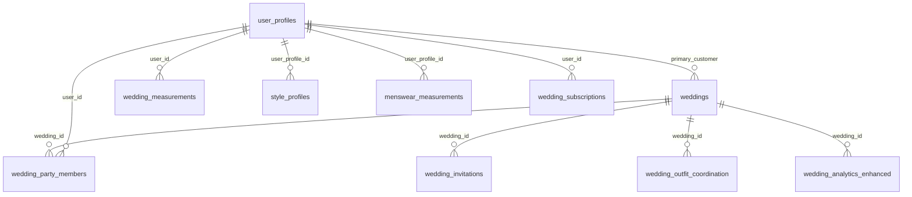
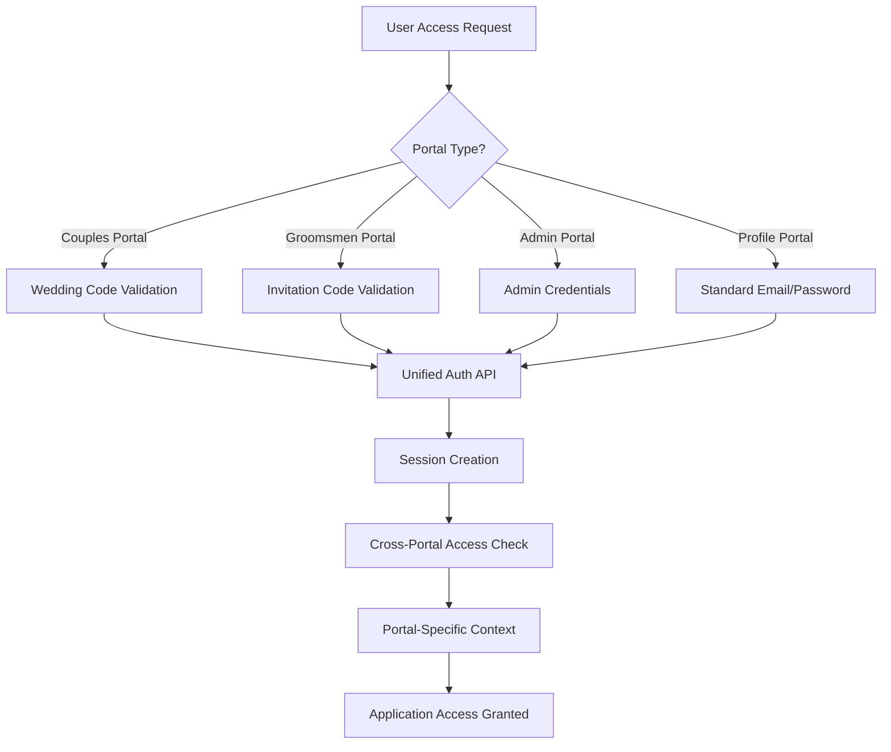

# KCT Ecosystem - Patterns and Integration Architecture

## Overview

This document outlines the architectural patterns, integration strategies, and code reuse patterns used across the KCT ecosystem. It covers database relationships, API conventions, authentication patterns, configuration management, and cross-application integration strategies.

## Architecture Overview

### 1. Monorepo Structure

```
kct-ecosystem-monorepo/
├── apps/                    # Individual applications
│   ├── admin-hub/          # Admin management portal
│   ├── inventory-manager/  # Inventory management system
│   ├── order-management/   # Order processing dashboard
│   ├── user-profiles/      # Enhanced user profile system
│   ├── wedding-portal/     # Couples wedding management
│   └── groomsmen-portal/   # Groomsmen invitation system
├── shared/                 # Shared resources
│   ├── components/         # Reusable React components
│   ├── hooks/             # Custom React hooks
│   ├── utils/             # Utility functions
│   ├── types/             # TypeScript interfaces
│   ├── constants/         # Application constants
│   ├── styles/            # Shared styling
│   └── supabase/          # Database schemas and migrations
├── docs/                  # Documentation
├── deployment/            # Deployment configurations
└── package.json          # Monorepo configuration
```

### 2. Application Architecture Pattern

Each application follows a consistent structure:

```
app-name/
├── src/
│   ├── components/        # App-specific components
│   ├── pages/            # Page components
│   ├── hooks/            # App-specific hooks
│   ├── contexts/         # React contexts
│   ├── lib/              # App-specific utilities
│   ├── types/            # App-specific types
│   └── App.tsx           # Root component
├── public/               # Static assets
├── package.json          # App dependencies
├── tailwind.config.js    # Styling configuration
├── vite.config.ts        # Build configuration
└── tsconfig.json         # TypeScript configuration
```

## Database Schema and Relationships

### 1. Core Entity Relationships



### 2. Database Design Patterns

**UUID Primary Keys**

All tables use UUID primary keys for security and scalability:

```sql
CREATE TABLE table_name (
    id UUID PRIMARY KEY DEFAULT gen_random_uuid(),
    -- other columns
    created_at TIMESTAMP WITH TIME ZONE DEFAULT NOW(),
    updated_at TIMESTAMP WITH TIME ZONE DEFAULT NOW()
);
```

**JSONB for Flexible Data**

Complex and flexible data structures use JSONB:

```sql
-- Wedding style preferences
style_preferences JSONB

-- Example data:
{
  "color_scheme": ["navy", "gray", "ivory"],
  "style": "modern_classic",
  "formality": "black_tie",
  "season": "fall"
}

-- Party member measurements
measurements JSONB

-- Example data:
{
  "chest": 42,
  "waist": 34,
  "height": 72,
  "suit_size": "40R",
  "measurement_date": "2024-08-15",
  "measurement_method": "professional"
}
```

**Audit Trail Pattern**

All tables include audit fields:

```sql
-- Standard audit fields
created_at TIMESTAMP WITH TIME ZONE DEFAULT NOW(),
updated_at TIMESTAMP WITH TIME ZONE DEFAULT NOW(),
created_by UUID REFERENCES user_profiles(user_id),
updated_by UUID REFERENCES user_profiles(user_id)
```

**Status Enum Pattern**

Consistent status field patterns:

```sql
-- Wedding status
status TEXT DEFAULT 'planning' CHECK (status IN ('planning', 'confirmed', 'completed', 'cancelled'))

-- Invitation status
invite_status TEXT DEFAULT 'pending' CHECK (invite_status IN ('pending', 'sent', 'accepted', 'declined'))

-- Order status
order_status TEXT DEFAULT 'pending' CHECK (order_status IN ('pending', 'processing', 'shipped', 'delivered', 'cancelled'))
```

### 3. Row Level Security (RLS) Patterns

**Admin Access Pattern**

```sql
-- Admin users bypass RLS with service role
ALTER TABLE table_name ENABLE ROW LEVEL SECURITY;

-- Allow service role full access
CREATE POLICY "Service role has full access" ON table_name
FOR ALL USING (auth.role() = 'service_role');

-- Admin users policy
CREATE POLICY "Admin users have full access" ON table_name
FOR ALL USING (
  EXISTS (
    SELECT 1 FROM user_profiles 
    WHERE user_id = auth.uid() 
    AND account_type = 'admin'
  )
);
```

**User-Specific Access Pattern**

```sql
-- Users can only access their own data
CREATE POLICY "Users can view own data" ON user_profiles
FOR SELECT USING (user_id = auth.uid());

CREATE POLICY "Users can update own data" ON user_profiles
FOR UPDATE USING (user_id = auth.uid());
```

**Wedding-Based Access Pattern**

```sql
-- Wedding party members can access wedding data
CREATE POLICY "Wedding party access" ON wedding_data
FOR SELECT USING (
  wedding_id IN (
    SELECT wedding_id FROM wedding_party_members 
    WHERE user_id = auth.uid()
  )
);
```

## Authentication and Authorization Patterns

### 1. Multi-Portal Authentication Architecture



### 2. Authentication Flow Patterns

**Wedding Code Authentication**

```typescript
// 1. Validate wedding code
const validation = await unifiedAuthAPI.validateWeddingCode(weddingCode)
if (!validation.success) {
  throw new Error('Invalid wedding code')
}

// 2. Authenticate or create user
const authResult = await unifiedAuthAPI.authenticateWithWeddingCode(
  weddingCode,
  email,
  password,
  userData
)

// 3. Create cross-portal session
const session = await unifiedAuthAPI.createCrossPortalSession(
  authResult.data.user.id,
  'couples_portal'
)

// 4. Sync profile data
await unifiedAuthAPI.syncProfileData(
  authResult.data.user.id,
  authResult.data.profile
)
```

**Cross-Portal Session Management**

```typescript
// Session info structure
interface SessionInfo {
  user_id: string
  profile: any
  access_levels: {
    enhanced_profile: boolean
    couples_portal: boolean
    groomsmen_portal: boolean
    admin_portal: boolean
  }
  couple_wedding: any
  party_member_data: any
  portal_context: {
    current_portal: string
    available_portals: string[]
    primary_role: string
  }
}

// Portal switching workflow
const switchPortal = async (targetPortal: string) => {
  // 1. Validate access to target portal
  const access = await unifiedAuthAPI.validatePortalAccess(userId, targetPortal)
  
  if (!access.hasAccess) {
    throw new Error(`Access denied: ${access.accessReason}`)
  }
  
  // 2. Switch context
  await unifiedAuthAPI.switchPortalContext(userId, targetPortal)
  
  // 3. Redirect to target portal
  window.location.href = getPortalURL(targetPortal)
}
```

### 3. Role-Based Access Control

**Role Hierarchy**

```typescript
enum UserRole {
  CUSTOMER = 'customer',
  GROOMSMAN = 'groomsman',
  BRIDE = 'bride',
  GROOM = 'groom',
  COORDINATOR = 'coordinator',
  ADMIN = 'admin',
  SUPER_ADMIN = 'super_admin'
}

enum PortalAccess {
  ENHANCED_PROFILE = 'enhanced_profile',
  COUPLES_PORTAL = 'couples_portal',
  GROOMSMEN_PORTAL = 'groomsmen_portal',
  ADMIN_PORTAL = 'admin_portal',
  INVENTORY_MANAGER = 'inventory_manager',
  ORDER_MANAGEMENT = 'order_management'
}
```

**Permission Checking Pattern**

```typescript
const checkPermission = async (
  userId: string, 
  portal: PortalAccess
): Promise<boolean> => {
  const userProfile = await getUserProfile(userId)
  const permissions = await getUserPermissions(userId)
  
  switch (portal) {
    case PortalAccess.ADMIN_PORTAL:
      return permissions.includes('admin') || permissions.includes('super_admin')
      
    case PortalAccess.COUPLES_PORTAL:
      return userProfile.wedding_role === 'bride' || userProfile.wedding_role === 'groom'
      
    case PortalAccess.GROOMSMEN_PORTAL:
      return permissions.includes('groomsman') || permissions.includes('best_man')
      
    default:
      return false
  }
}
```

## API Patterns and Conventions

### 1. Supabase Edge Function Pattern

All APIs follow a consistent pattern using Supabase Edge Functions:

```typescript
// Standard edge function structure
export default async function handler(req: Request) {
  try {
    // 1. Parse request
    const { action, ...params } = await req.json()
    
    // 2. Validate authentication
    const authHeader = req.headers.get('Authorization')
    const user = await validateAuth(authHeader)
    
    // 3. Route action
    switch (action) {
      case 'action_name':
        return await handleAction(params, user)
      default:
        throw new Error('Invalid action')
    }
  } catch (error) {
    return new Response(
      JSON.stringify({
        success: false,
        error: {
          code: 'API_ERROR',
          message: error.message
        }
      }),
      { status: 400 }
    )
  }
}
```

### 2. API Response Format

**Standard Response Structure**

```typescript
interface ApiResponse<T> {
  success: boolean
  data?: T
  error?: {
    code: string
    message: string
    details?: any
  }
  metadata?: {
    timestamp: string
    request_id: string
    version: string
  }
}

// Success response
{
  "success": true,
  "data": { /* response data */ },
  "metadata": {
    "timestamp": "2024-08-19T15:17:21Z",
    "request_id": "req_123456",
    "version": "1.0"
  }
}

// Error response
{
  "success": false,
  "error": {
    "code": "VALIDATION_ERROR",
    "message": "Invalid input provided",
    "details": {
      "field": "email",
      "reason": "Invalid email format"
    }
  }
}
```

### 3. Error Handling Patterns

**Centralized Error Handling**

```typescript
// Error types
enum ErrorCode {
  VALIDATION_ERROR = 'VALIDATION_ERROR',
  AUTHENTICATION_ERROR = 'AUTHENTICATION_ERROR',
  AUTHORIZATION_ERROR = 'AUTHORIZATION_ERROR',
  NOT_FOUND = 'NOT_FOUND',
  CONFLICT = 'CONFLICT',
  INTERNAL_ERROR = 'INTERNAL_ERROR'
}

// Error handler
class APIError extends Error {
  constructor(
    public code: ErrorCode,
    message: string,
    public details?: any
  ) {
    super(message)
    this.name = 'APIError'
  }
}

// Error response helper
const handleError = (error: any): Response => {
  if (error instanceof APIError) {
    return new Response(
      JSON.stringify({
        success: false,
        error: {
          code: error.code,
          message: error.message,
          details: error.details
        }
      }),
      { status: getStatusCode(error.code) }
    )
  }
  
  // Unknown error
  return new Response(
    JSON.stringify({
      success: false,
      error: {
        code: ErrorCode.INTERNAL_ERROR,
        message: 'An unexpected error occurred'
      }
    }),
    { status: 500 }
  )
}
```

**Client-Side Error Handling**

```typescript
// API client with error handling
const apiClient = {
  async request<T>(endpoint: string, options: RequestOptions): Promise<T> {
    try {
      const response = await fetch(endpoint, options)
      const data = await response.json()
      
      if (!data.success) {
        throw new APIError(data.error.code, data.error.message, data.error.details)
      }
      
      return data.data
    } catch (error) {
      if (error instanceof APIError) {
        throw error
      }
      
      // Network or parsing error
      throw new APIError(
        ErrorCode.INTERNAL_ERROR,
        'Failed to communicate with server'
      )
    }
  }
}
```

## Configuration Management Patterns

### 1. Environment Configuration

**Application-Level Configuration**

```typescript
// config/environment.ts
interface AppConfig {
  supabase: {
    url: string
    anonKey: string
    serviceKey?: string
  }
  app: {
    name: string
    version: string
    environment: 'development' | 'staging' | 'production'
  }
  features: {
    enableAnalytics: boolean
    enableNotifications: boolean
    debugMode: boolean
  }
}

const config: AppConfig = {
  supabase: {
    url: process.env.VITE_SUPABASE_URL || 'https://gvcswimqaxvylgxbklbz.supabase.co',
    anonKey: process.env.VITE_SUPABASE_ANON_KEY || 'default_key',
    serviceKey: process.env.SUPABASE_SERVICE_ROLE_KEY
  },
  app: {
    name: process.env.VITE_APP_NAME || 'KCT App',
    version: process.env.VITE_APP_VERSION || '1.0.0',
    environment: (process.env.NODE_ENV as any) || 'development'
  },
  features: {
    enableAnalytics: process.env.VITE_ENABLE_ANALYTICS === 'true',
    enableNotifications: process.env.VITE_ENABLE_NOTIFICATIONS === 'true',
    debugMode: process.env.NODE_ENV === 'development'
  }
}

export default config
```

### 2. Build Configuration Patterns

**Vite Configuration**

```typescript
// vite.config.ts - Standard configuration across all apps
import { defineConfig } from 'vite'
import react from '@vitejs/plugin-react'
import path from 'path'

export default defineConfig({
  plugins: [react()],
  resolve: {
    alias: {
      '@': path.resolve(__dirname, './src'),
      '@shared': path.resolve(__dirname, '../../shared')
    }
  },
  define: {
    'process.env.BUILD_MODE': JSON.stringify(process.env.BUILD_MODE || 'development')
  },
  build: {
    rollupOptions: {
      output: {
        manualChunks: {
          vendor: ['react', 'react-dom'],
          supabase: ['@supabase/supabase-js'],
          ui: ['@radix-ui/react-dialog', '@radix-ui/react-dropdown-menu']
        }
      }
    }
  }
})
```

**Package.json Scripts Pattern**

```json
{
  "scripts": {
    "dev": "yes | pnpm install && vite",
    "build": "yes | pnpm install && rm -rf node_modules/.vite-temp && tsc -b && vite build",
    "build:prod": "yes | pnpm install && rm -rf node_modules/.vite-temp && tsc -b && BUILD_MODE=prod vite build",
    "lint": "yes | pnpm install && eslint .",
    "preview": "yes | pnpm install && vite preview"
  }
}
```

### 3. Deployment Configuration

**Vercel Configuration Pattern**

```json
// deployment/vercel-app-name.json
{
  "version": 2,
  "name": "kct-app-name",
  "builds": [
    {
      "src": "apps/app-name/package.json",
      "use": "@vercel/static-build",
      "config": {
        "distDir": "dist"
      }
    }
  ],
  "routes": [
    {
      "src": "/(.*)",
      "dest": "/index.html"
    }
  ],
  "env": {
    "VITE_SUPABASE_URL": "@supabase_url",
    "VITE_SUPABASE_ANON_KEY": "@supabase_anon_key",
    "VITE_APP_NAME": "KCT App Name"
  }
}
```

## Data Synchronization Patterns

### 1. Profile Data Synchronization

**Cross-Portal Profile Sync**

```typescript
// Profile synchronization workflow
const syncProfileAcrossPortals = async (userId: string, updates: Partial<UserProfile>) => {
  try {
    // 1. Update primary profile
    const primaryProfile = await updateUserProfile(userId, updates)
    
    // 2. Sync to wedding system if user is wedding customer
    if (primaryProfile.is_wedding_customer) {
      await syncToWeddingSystem(userId, updates)
    }
    
    // 3. Sync measurements if provided
    if (updates.measurements) {
      await syncMeasurementData(userId, updates.measurements)
    }
    
    // 4. Update cache
    await updateProfileCache(userId, primaryProfile)
    
    // 5. Trigger notifications
    await triggerProfileUpdateNotifications(userId, updates)
    
    return primaryProfile
  } catch (error) {
    console.error('Profile sync failed:', error)
    throw error
  }
}
```

### 2. Real-time Data Synchronization

**WebSocket/Real-time Patterns**

```typescript
// Real-time subscription setup
const setupRealTimeSync = (userId: string) => {
  // Profile updates
  const profileSubscription = supabase
    .channel(`profile_${userId}`)
    .on(
      'postgres_changes',
      {
        event: 'UPDATE',
        schema: 'public',
        table: 'user_profiles',
        filter: `user_id=eq.${userId}`
      },
      (payload) => {
        handleProfileUpdate(payload.new)
      }
    )
    .subscribe()

  // Wedding updates (if applicable)
  const weddingSubscription = supabase
    .channel(`wedding_${userId}`)
    .on(
      'postgres_changes',
      {
        event: '*',
        schema: 'public',
        table: 'weddings',
        filter: `primary_customer_id=eq.${userId}`
      },
      (payload) => {
        handleWeddingUpdate(payload)
      }
    )
    .subscribe()

  return () => {
    profileSubscription.unsubscribe()
    weddingSubscription.unsubscribe()
  }
}
```

### 3. Data Consistency Patterns

**Optimistic Updates**

```typescript
// Optimistic update pattern
const optimisticUpdate = async <T>(
  localState: T,
  updateFunction: () => Promise<T>,
  rollbackFunction: (error: any) => void
) => {
  try {
    // Apply optimistic update immediately
    const optimisticResult = await updateFunction()
    return optimisticResult
  } catch (error) {
    // Rollback on failure
    rollbackFunction(error)
    throw error
  }
}

// Usage example
const updateProfile = async (updates: Partial<UserProfile>) => {
  const originalProfile = { ...currentProfile }
  
  return optimisticUpdate(
    { ...currentProfile, ...updates },
    () => ProfileAPI.updateProfile(updates),
    (error) => {
      setCurrentProfile(originalProfile)
      showErrorNotification('Failed to update profile')
    }
  )
}
```

## Integration Patterns

### 1. Cross-Application Communication

**Shared State Management**

```typescript
// Shared authentication state
interface GlobalAuthState {
  user: User | null
  session: Session | null
  profile: UserProfile | null
  permissions: string[]
  activePortal: string
}

// Context provider for cross-app state
export const GlobalAuthProvider = ({ children }: { children: ReactNode }) => {
  const [authState, setAuthState] = useState<GlobalAuthState>({
    user: null,
    session: null,
    profile: null,
    permissions: [],
    activePortal: 'unknown'
  })

  // Sync state across browser tabs
  useEffect(() => {
    const channel = new BroadcastChannel('auth_state')
    
    channel.onmessage = (event) => {
      if (event.data.type === 'AUTH_STATE_UPDATE') {
        setAuthState(event.data.state)
      }
    }

    return () => channel.close()
  }, [])

  const updateAuthState = (newState: Partial<GlobalAuthState>) => {
    const updatedState = { ...authState, ...newState }
    setAuthState(updatedState)
    
    // Broadcast to other tabs
    const channel = new BroadcastChannel('auth_state')
    channel.postMessage({
      type: 'AUTH_STATE_UPDATE',
      state: updatedState
    })
  }

  return (
    <GlobalAuthContext.Provider value={{ authState, updateAuthState }}>
      {children}
    </GlobalAuthContext.Provider>
  )
}
```

### 2. Service Integration Patterns

**External API Integration**

```typescript
// External service integration pattern
class ExternalServiceClient {
  private baseURL: string
  private apiKey: string

  constructor(config: { baseURL: string; apiKey: string }) {
    this.baseURL = config.baseURL
    this.apiKey = config.apiKey
  }

  async request<T>(endpoint: string, options: RequestInit = {}): Promise<T> {
    const url = `${this.baseURL}${endpoint}`
    const headers = {
      'Content-Type': 'application/json',
      'Authorization': `Bearer ${this.apiKey}`,
      ...options.headers
    }

    try {
      const response = await fetch(url, { ...options, headers })
      
      if (!response.ok) {
        throw new Error(`HTTP ${response.status}: ${response.statusText}`)
      }

      return await response.json()
    } catch (error) {
      console.error(`External API request failed:`, error)
      throw error
    }
  }
}

// Usage for shipping API
const easyPostClient = new ExternalServiceClient({
  baseURL: 'https://api.easypost.com/v2',
  apiKey: process.env.EASYPOST_API_KEY
})
```

### 3. Event-Driven Architecture

**Domain Events Pattern**

```typescript
// Event system for cross-application communication
interface DomainEvent {
  type: string
  data: any
  timestamp: Date
  source: string
}

class EventBus {
  private listeners: Map<string, Function[]> = new Map()

  emit(event: DomainEvent) {
    const handlers = this.listeners.get(event.type) || []
    handlers.forEach(handler => {
      try {
        handler(event)
      } catch (error) {
        console.error(`Event handler error:`, error)
      }
    })
  }

  on(eventType: string, handler: Function) {
    const handlers = this.listeners.get(eventType) || []
    handlers.push(handler)
    this.listeners.set(eventType, handlers)

    // Return unsubscribe function
    return () => {
      const updatedHandlers = handlers.filter(h => h !== handler)
      this.listeners.set(eventType, updatedHandlers)
    }
  }
}

// Global event bus
export const globalEventBus = new EventBus()

// Event definitions
export const Events = {
  PROFILE_UPDATED: 'profile.updated',
  ORDER_CREATED: 'order.created',
  WEDDING_CREATED: 'wedding.created',
  INVITATION_SENT: 'invitation.sent'
} as const

// Usage
globalEventBus.on(Events.PROFILE_UPDATED, (event) => {
  console.log('Profile updated:', event.data)
  // Sync profile across applications
  syncProfileToWeddingSystem(event.data)
})
```

## Code Reuse and Shared Logic Patterns

### 1. Custom Hooks Pattern

**Common Custom Hooks**

```typescript
// useAuth hook - consistent across all applications
export const useAuth = () => {
  const [user, setUser] = useState<User | null>(null)
  const [loading, setLoading] = useState(true)
  const [error, setError] = useState<string | null>(null)

  useEffect(() => {
    const { data: { subscription } } = supabase.auth.onAuthStateChange(
      async (event, session) => {
        setUser(session?.user || null)
        setLoading(false)
      }
    )

    return () => subscription.unsubscribe()
  }, [])

  const signIn = async (email: string, password: string) => {
    setLoading(true)
    setError(null)
    
    try {
      const { data, error } = await supabase.auth.signInWithPassword({
        email,
        password
      })
      
      if (error) throw error
      return data
    } catch (error: any) {
      setError(error.message)
      throw error
    } finally {
      setLoading(false)
    }
  }

  const signOut = async () => {
    await supabase.auth.signOut()
  }

  return { user, loading, error, signIn, signOut }
}

// useAPI hook - for consistent API calls
export const useAPI = <T>(
  apiFunction: () => Promise<T>,
  dependencies: any[] = []
) => {
  const [data, setData] = useState<T | null>(null)
  const [loading, setLoading] = useState(true)
  const [error, setError] = useState<string | null>(null)

  useEffect(() => {
    const fetchData = async () => {
      try {
        setLoading(true)
        setError(null)
        const result = await apiFunction()
        setData(result)
      } catch (err: any) {
        setError(err.message)
      } finally {
        setLoading(false)
      }
    }

    fetchData()
  }, dependencies)

  const refetch = () => {
    fetchData()
  }

  return { data, loading, error, refetch }
}
```

### 2. Higher-Order Components (HOC) Pattern

**Authentication HOC**

```typescript
// withAuth HOC for protected routes
export const withAuth = <P extends object>(
  WrappedComponent: React.ComponentType<P>,
  requiredPermissions?: string[]
) => {
  return (props: P) => {
    const { user, loading } = useAuth()
    const navigate = useNavigate()

    useEffect(() => {
      if (!loading && !user) {
        navigate('/login')
      }
    }, [user, loading, navigate])

    if (loading) {
      return <LoadingSpinner />
    }

    if (!user) {
      return null
    }

    // Check permissions if required
    if (requiredPermissions) {
      const hasPermission = checkUserPermissions(user, requiredPermissions)
      if (!hasPermission) {
        return <div>Access Denied</div>
      }
    }

    return <WrappedComponent {...props} />
  }
}

// Usage
export default withAuth(AdminDashboard, ['admin'])
```

### 3. Render Props Pattern

**Data Fetcher Component**

```typescript
// DataFetcher component using render props
interface DataFetcherProps<T> {
  apiCall: () => Promise<T>
  children: (props: {
    data: T | null
    loading: boolean
    error: string | null
    refetch: () => void
  }) => React.ReactNode
}

export const DataFetcher = <T,>({ apiCall, children }: DataFetcherProps<T>) => {
  const { data, loading, error, refetch } = useAPI(apiCall)
  
  return <>{children({ data, loading, error, refetch })}</>
}

// Usage
<DataFetcher apiCall={() => ProfileAPI.getProfile()}>
  {({ data: profile, loading, error, refetch }) => {
    if (loading) return <LoadingSpinner />
    if (error) return <div>Error: {error}</div>
    if (!profile) return <div>No profile found</div>
    
    return <ProfileDisplay profile={profile} onRefresh={refetch} />
  }}
</DataFetcher>
```

## Performance Optimization Patterns

### 1. Code Splitting and Lazy Loading

**Route-Based Code Splitting**

```typescript
// Route-based lazy loading
import { lazy, Suspense } from 'react'
import { Routes, Route } from 'react-router-dom'

const Dashboard = lazy(() => import('./pages/Dashboard'))
const Profile = lazy(() => import('./pages/Profile'))
const Orders = lazy(() => import('./pages/Orders'))

export const AppRoutes = () => (
  <Suspense fallback={<LoadingSpinner />}>
    <Routes>
      <Route path="/dashboard" element={<Dashboard />} />
      <Route path="/profile" element={<Profile />} />
      <Route path="/orders" element={<Orders />} />
    </Routes>
  </Suspense>
)
```

**Component-Based Code Splitting**

```typescript
// Feature-based lazy loading
const LazyModalComponent = lazy(() => 
  import('./components/ComplexModal').then(module => ({
    default: module.ComplexModal
  }))
)

export const ModalTrigger = () => {
  const [showModal, setShowModal] = useState(false)
  
  return (
    <>
      <button onClick={() => setShowModal(true)}>
        Open Modal
      </button>
      
      {showModal && (
        <Suspense fallback={<div>Loading modal...</div>}>
          <LazyModalComponent onClose={() => setShowModal(false)} />
        </Suspense>
      )}
    </>
  )
}
```

### 2. Memoization Patterns

**Component Memoization**

```typescript
// Memoized component with custom comparison
export const OptimizedListItem = memo(
  ({ item, onUpdate }: { item: ListItem; onUpdate: (id: string) => void }) => {
    const handleUpdate = useCallback(() => {
      onUpdate(item.id)
    }, [item.id, onUpdate])

    return (
      <div className="list-item">
        <span>{item.name}</span>
        <button onClick={handleUpdate}>Update</button>
      </div>
    )
  },
  (prevProps, nextProps) => {
    // Custom comparison function
    return (
      prevProps.item.id === nextProps.item.id &&
      prevProps.item.name === nextProps.item.name &&
      prevProps.item.updatedAt === nextProps.item.updatedAt
    )
  }
)
```

### 3. Caching Strategies

**API Response Caching**

```typescript
// Simple in-memory cache
class APICache {
  private cache = new Map<string, { data: any; timestamp: number }>()
  private ttl = 5 * 60 * 1000 // 5 minutes

  set(key: string, data: any) {
    this.cache.set(key, {
      data,
      timestamp: Date.now()
    })
  }

  get(key: string) {
    const cached = this.cache.get(key)
    
    if (!cached) return null
    
    if (Date.now() - cached.timestamp > this.ttl) {
      this.cache.delete(key)
      return null
    }
    
    return cached.data
  }

  clear() {
    this.cache.clear()
  }
}

const apiCache = new APICache()

// Cached API call wrapper
export const cachedApiCall = async <T>(
  key: string,
  apiFunction: () => Promise<T>
): Promise<T> => {
  // Check cache first
  const cached = apiCache.get(key)
  if (cached) {
    return cached
  }

  // Make API call and cache result
  const result = await apiFunction()
  apiCache.set(key, result)
  
  return result
}
```

## Testing Patterns

### 1. Component Testing Patterns

**Standard Component Test Structure**

```typescript
// Component test template
import { render, screen, fireEvent, waitFor } from '@testing-library/react'
import { BrowserRouter } from 'react-router-dom'
import { ComponentName } from './ComponentName'

// Test wrapper with providers
const TestWrapper = ({ children }: { children: React.ReactNode }) => (
  <BrowserRouter>
    <AuthProvider>
      {children}
    </AuthProvider>
  </BrowserRouter>
)

describe('ComponentName', () => {
  const defaultProps = {
    // Default test props
  }

  const renderComponent = (props = {}) => {
    return render(
      <ComponentName {...defaultProps} {...props} />,
      { wrapper: TestWrapper }
    )
  }

  it('renders correctly', () => {
    renderComponent()
    expect(screen.getByText('Expected Text')).toBeInTheDocument()
  })

  it('handles user interaction', async () => {
    const mockCallback = jest.fn()
    renderComponent({ onAction: mockCallback })
    
    fireEvent.click(screen.getByRole('button'))
    
    await waitFor(() => {
      expect(mockCallback).toHaveBeenCalledWith(expectedArgs)
    })
  })

  it('displays loading state', () => {
    renderComponent({ loading: true })
    expect(screen.getByTestId('loading-spinner')).toBeInTheDocument()
  })

  it('handles error state', () => {
    renderComponent({ error: 'Test error message' })
    expect(screen.getByText('Test error message')).toBeInTheDocument()
  })
})
```

### 2. API Testing Patterns

**Mock API Responses**

```typescript
// API mock utilities
export const mockApiResponse = <T>(data: T, delay = 0): Promise<T> => {
  return new Promise((resolve) => {
    setTimeout(() => resolve(data), delay)
  })
}

export const mockApiError = (message: string, delay = 0): Promise<never> => {
  return new Promise((_, reject) => {
    setTimeout(() => reject(new Error(message)), delay)
  })
}

// Test with mocked API
jest.mock('../api/ProfileAPI', () => ({
  getProfile: jest.fn(),
  updateProfile: jest.fn()
}))

describe('Profile Component with API', () => {
  it('loads and displays profile data', async () => {
    const mockProfile = { name: 'John Doe', email: 'john@example.com' }
    
    ;(ProfileAPI.getProfile as jest.Mock).mockResolvedValue(mockProfile)
    
    render(<ProfileComponent />)
    
    await waitFor(() => {
      expect(screen.getByText('John Doe')).toBeInTheDocument()
      expect(screen.getByText('john@example.com')).toBeInTheDocument()
    })
  })
})
```

## Security Patterns

### 1. Input Validation

**Client-Side Validation**

```typescript
// Input sanitization utilities
export const sanitizeUtils = {
  escapeHtml: (unsafe: string): string => {
    return unsafe
      .replace(/&/g, "&amp;")
      .replace(/</g, "&lt;")
      .replace(/>/g, "&gt;")
      .replace(/"/g, "&quot;")
      .replace(/'/g, "&#039;")
  },
  
  sanitizeEmail: (email: string): string => {
    return email.toLowerCase().trim()
  },
  
  sanitizePhoneNumber: (phone: string): string => {
    return phone.replace(/[^\d+\-\(\)\s]/g, '')
  }
}

// Form validation with sanitization
const validateAndSanitizeForm = (formData: any) => {
  const sanitized = {
    email: sanitizeUtils.sanitizeEmail(formData.email),
    name: sanitizeUtils.escapeHtml(formData.name),
    phone: sanitizeUtils.sanitizePhoneNumber(formData.phone)
  }
  
  // Additional validation
  const errors: string[] = []
  
  if (!isValidEmail(sanitized.email)) {
    errors.push('Invalid email format')
  }
  
  if (sanitized.name.length < 2) {
    errors.push('Name must be at least 2 characters')
  }
  
  return { sanitized, errors }
}
```

### 2. Authentication Security

**JWT Token Handling**

```typescript
// Secure token management
class TokenManager {
  private static readonly TOKEN_KEY = 'auth_token'
  
  static setToken(token: string): void {
    // Store in httpOnly cookie if possible, fallback to localStorage
    if (this.canUseHttpOnlyCookies()) {
      document.cookie = `${this.TOKEN_KEY}=${token}; HttpOnly; Secure; SameSite=Strict`
    } else {
      localStorage.setItem(this.TOKEN_KEY, token)
    }
  }
  
  static getToken(): string | null {
    try {
      return localStorage.getItem(this.TOKEN_KEY)
    } catch {
      return null
    }
  }
  
  static removeToken(): void {
    localStorage.removeItem(this.TOKEN_KEY)
    document.cookie = `${this.TOKEN_KEY}=; expires=Thu, 01 Jan 1970 00:00:00 UTC; path=/;`
  }
  
  private static canUseHttpOnlyCookies(): boolean {
    return typeof document !== 'undefined' && window.location.protocol === 'https:'
  }
}
```

This comprehensive patterns documentation provides the architectural foundation for building consistent, scalable, and maintainable applications within the KCT ecosystem. All patterns are designed to work together seamlessly while providing flexibility for future enhancements and integrations.
